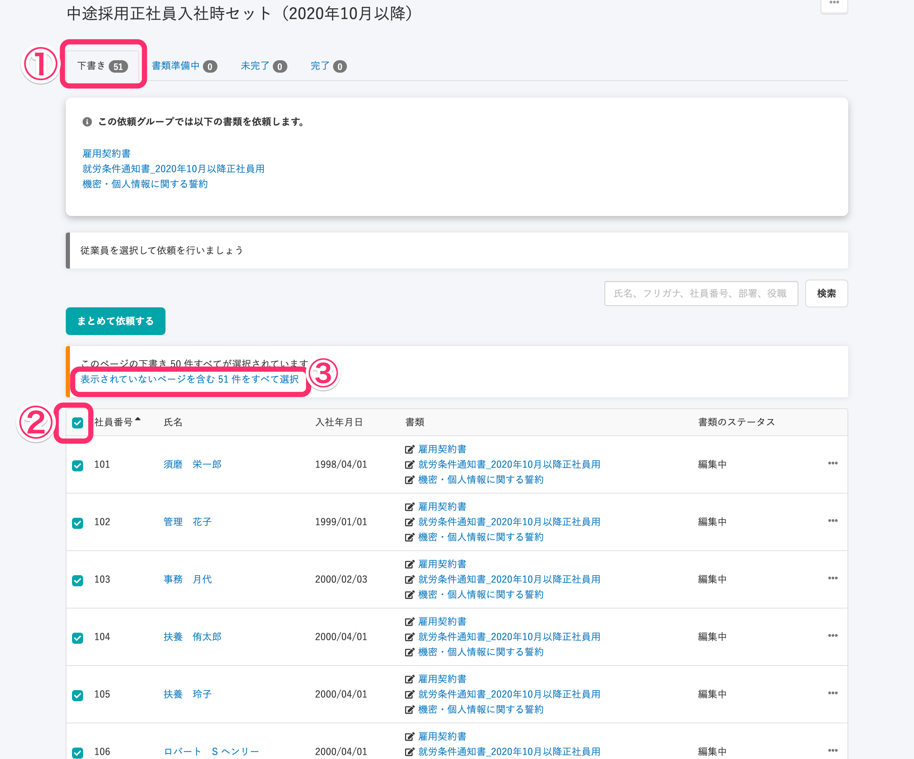
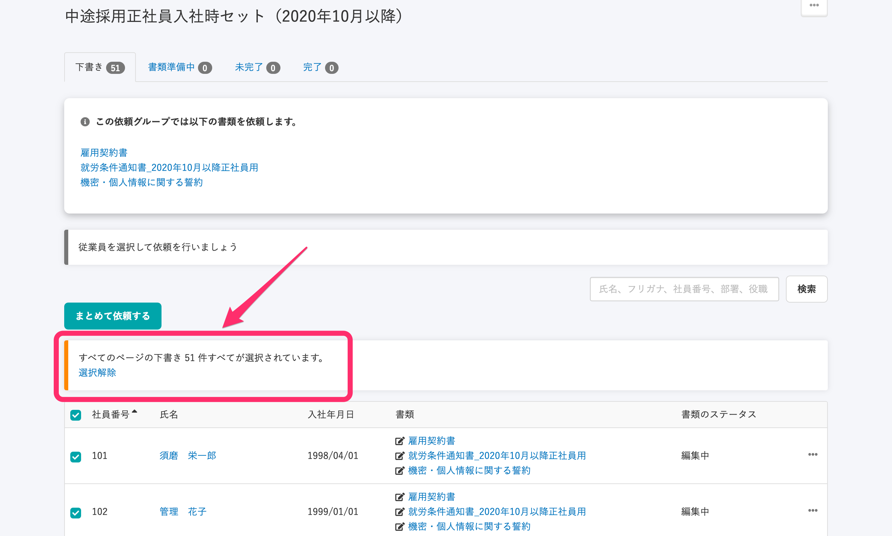

2020年10月29日（木）に行なったアップデートの詳細をお知らせします。

文書配付機能のリリースは、不具合修正1件でした。

# 👨‍⚕️ 不具合修正

## 依頼グループ詳細で全件選択を解除した際の動作が正しくなるように修正しました

依頼グループ詳細画面の **\[下書き\] \[未完了\]** タブで、ページを跨いだ全件選択を解除する際に、これまでは従業員が正しく選択されず下記の状態になっていました。

- 下書きタブでは、ページを跨いで全件選択中に **\[選択解除\]** を押しても選択中の件数が変わらない（ページを跨いで全件選択のまま）
- 未完了タブでは、ページを跨いで全件選択中に **\[選択解除\]** を押すと表示中のページの依頼も選択解除されてしまう

しかし、正しい動作は「どちらのタブでも、ページを跨いで全件選択中に **\[選択解除\]** を押すと、表示中のページの全件選択に戻る」でした。

そのため今回の改修で、**\[選択解除\]** によって「ページをまたいだ依頼グループの全件選択」から「今表示されているページだけの全件選択」に切り替わるように変更しました。

すこしややこしいので、以下に具体例を挙げます。

依頼グループ詳細画面の **\[下書き\] \[未完了\]** タブでの全件選択・選択解除の操作を見てみると、

① 1ページに50人表示されるようになっているので、下図では2ページ目に1人従業員がいます。

② **\[社員番号\]** の左にあるチェックボックスにチェックを入れると、表示中のページの従業員全員（50人）が選択されます。

③ ②を実施すると、**\[表示されていないページを含む51件をすべて選択\]** のメッセージが表示され、クリックすると2ページ目の従業員も含めてすべての従業員が選択されます。

④ ③を実施すると**\[選択解除\]** のメッセージが表示され、クリックすると2ページ以降で選択されている従業員の選択が解除されます。（表示中のページの従業員は選択されたままです）

