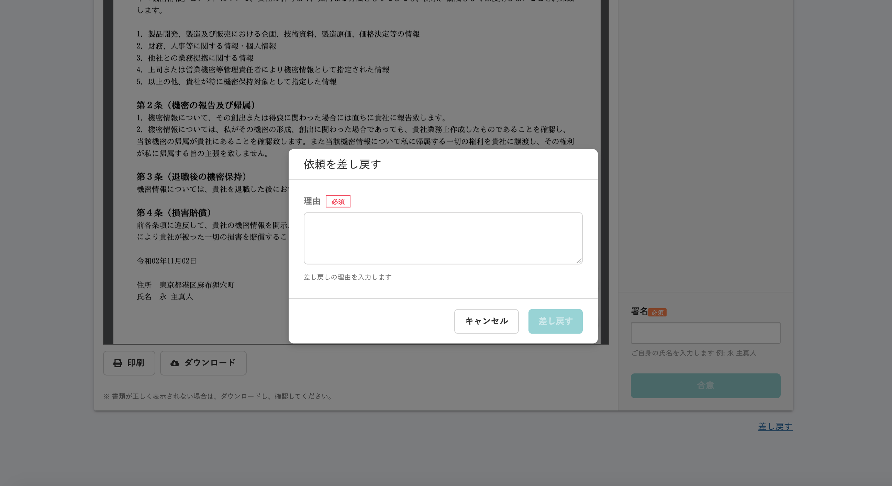

2020年10月30日（金）に行なったアップデートの詳細をお知らせします。
文書配付機能の変更点は、カイゼン1件・不具合修正1件でした。

# 📈 カイゼン

## 書類差し戻しダイアログの位置を変更しました

書類差し戻しで表示されるダイアログが、他のダイアログより画面上部に位置していたため、他のものと表示位置を合わせました。

また、同時にSmartHR UIを適用したデザインに変更しました。

| 変更前 |  |
| --- | --- |
| 変更後 |  |

# 👨‍⚕️ 不具合修正

依頼グループ検索時でのページ番号に関する1件の不具合修正を行ないました。
