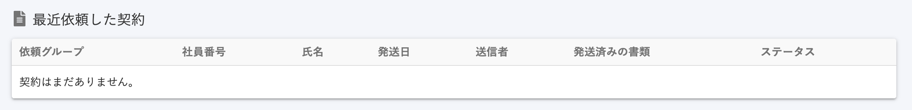
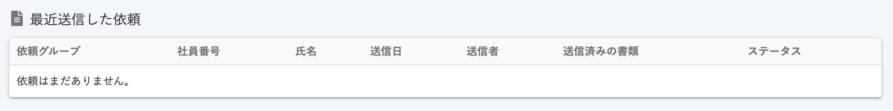

2020年11月2日（月）に行なったアップデートの詳細をお知らせします。

文書配付機能のリリースは、カイゼン1件でした。

# 📈 カイゼン

## ダッシュボードの文言を「最近送信した依頼」に変更しました

ダッシュボードのタイトル文言を **\[最近依頼した契約\]** から、「契約」とは限らない文書も依頼されるため **\[最近送信した依頼\]** に変更しました。

またこの改修にともない、他の画面表記と合わせるため下記の文言も変更しました。

- **\[発送日\]** → **\[送信日\]**
- **\[発送済みの書類\]** → **\[送信済みの書類\]**
- **\[契約はまだありません\]** → **\[依頼はまだありません\]**（依頼の書類がない場合）

| 変更前 |  |
| --- | --- |
| 変更後 |  |
