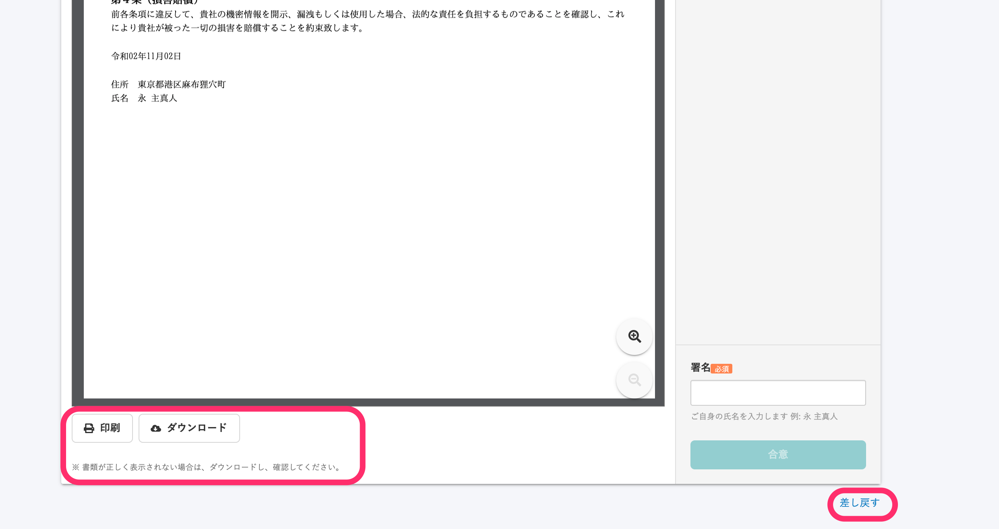
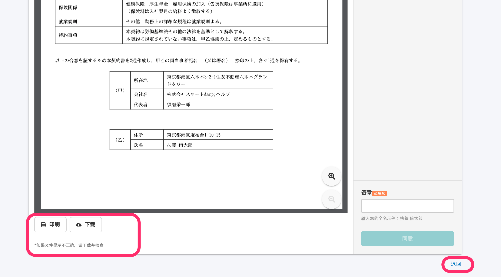
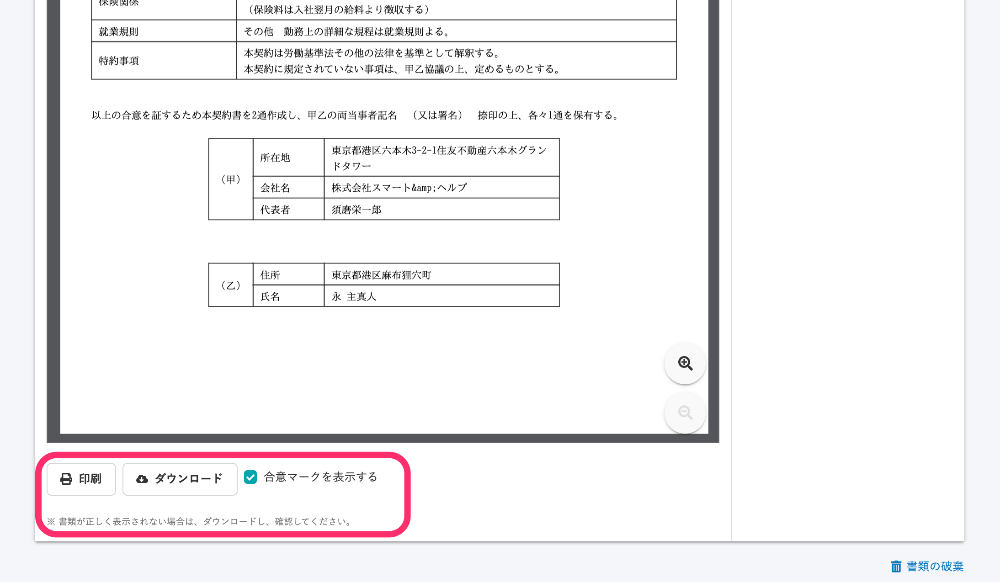
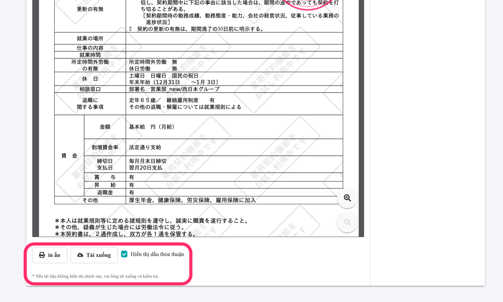
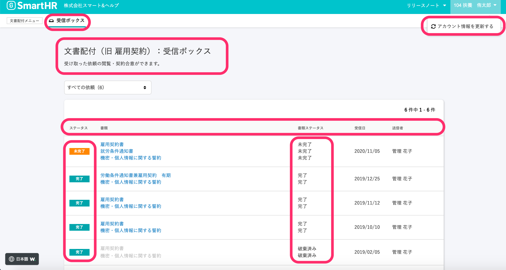

2020年11月10日（火）に行なったアップデートの詳細をお知らせします。

文書配付機能のリリースは、アクセシビリティ1件でした。

# 🎢 アクセシビリティ

## 書類詳細画面と受信ボックスの多言語対応箇所を増やしました

書類詳細画面（PC・スマートフォン）と受信ボックス画面（PCのみ）を多言語対応しました。

対応言語は、韓国語・中国語・ベトナム語で、英語は近日中に公開します。

多言語表示を有効にしている場合は、以下の部分が翻訳されます。

 **書類詳細対応箇所（合意前）** 

| 日本語 |   ****   |
| --- | --- |
| 中国語 |  |

 **書類詳細対応箇所（合意後）** 

| 日本語 |  |
| --- | --- |
|   ベトナム語   |  |

**受信ボックス対応箇所**

| 日本語 |  |
| --- | --- |
|   韓国語   |  |

多言語化対応については下記のページをご覧ください。

:::related
[多言語化対応について](https://knowledge.smarthr.jp/hc/ja/articles/360035659594)
:::
