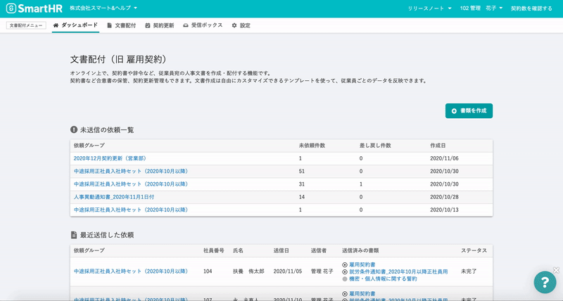

2020年11月12日（木）に行なったアップデートの詳細をお知らせします。

文書配付機能の変更点は、カイゼン1件でした。

# 📈 カイゼン

## チャットボットを表示するようにしました

文書配付画面右下の **\[?\]** アイコンをクリックすると、チャットボットが開き、よくあるお問い合わせについて、会話形式で探せるようにしました。

これまでチャットの問い合わせが混み合っているときなどは、お待たせしてしまうことがありましたが、こちらのチャットボットを使用することで、知りたい情報を探していただきやすくなりました。

質問の項目ごとに自動で回答されヘルプページへの案内に進みますが、該当の質問がない場合は **\[担当者にチャットで問い合わせる\]** をクリックすると有人のチャットサポートにつながります。

文書配付に関する質問は、 **\[管理者として利用している\]** \> **\[機能一覧、オプション機能\]** \> **\[文書配付（旧：雇用契約）\]** からご利用いただけます。

