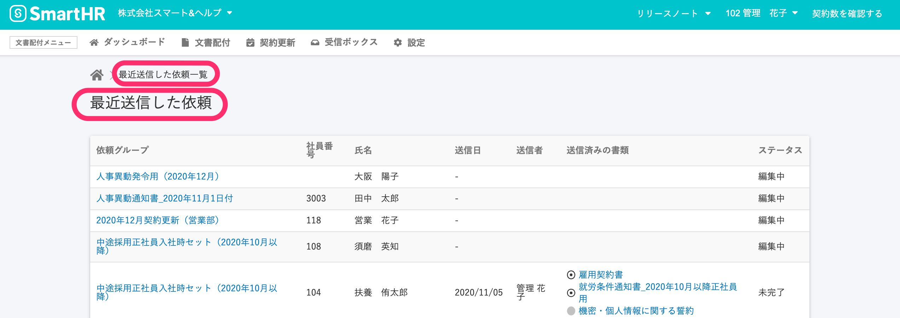

2020年11月17日（火）に行なったアップデートの詳細をお知らせします。

文書配付機能のリリースは、アクセシビリティ1件でした。

# 🎢 アクセシビリティ

## ダッシュボードに残っていた「契約」の文言を「依頼」に変更しました

11/2にダッシュボード上の文言を文書配付機能に適したものに改修しましたが、ダッシュボードの **\[最近送信した依頼\]** > **右下の** **\[一覧を見る\]** をクリックした一覧画面でも、文言を下記のとおりに変更しました。

- **\[最近依頼した契約一覧\]** → **\[最近送信した依頼一覧\]**
- **\[最近依頼した契約\]** → **\[最近送信した依頼\]**
- 依頼が一つもないとき：**\[依頼はまだありません\]**

:::related
[2020/11/02 ダッシュボードの文言を「最近送信した依頼」に変更しました](https://knowledge.smarthr.jp/hc/ja/articles/360056764574)
:::
