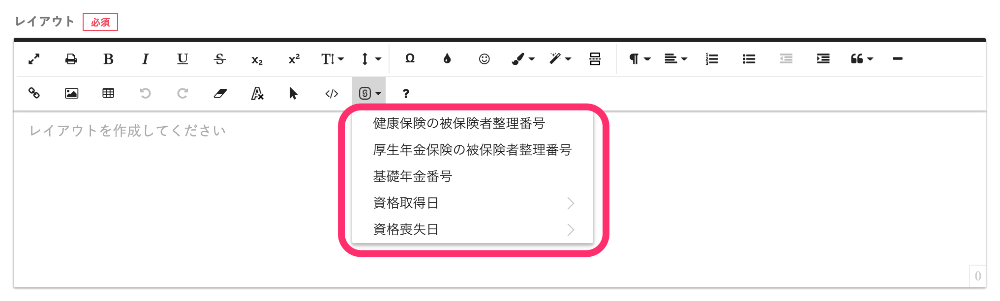

2020年11月18日（水）に行なったアップデートの詳細をお知らせします。

文書配付機能の変更点は、カイゼン1件でした。

# 📈 カイゼン

## テンプレート変数に社会保険関係の項目を追加しました

以下の社会保険関係の従業員項目を、社会保険カテゴリのテンプレート変数として差し込めるようにしました。

- 健康保険の被保険者整理番号（※これまで「社会保険 健康保険の被保険者整理番号」でしたが同カテゴリに含めました）
- 厚生年金保険の被保険者整理番号
- 基礎年金番号
- 資格取得日
- 資格喪失日

**\[SmartHRのデータを挿入する\]** アイコン>**\[従業員\]**\>**\[社会保険\]** から挿入できます。

テンプレート変数を使った書類テンプレートの作成方法は、下記のページをご覧ください。

:::related
[テンプレート変数を使って書類テンプレートを作成する](https://knowledge.smarthr.jp/hc/ja/articles/360036818773)
:::
