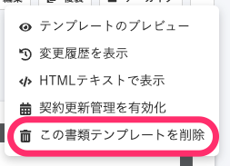
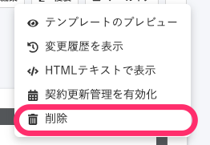

2020年11月20日（金）に行なったアップデートの詳細をお知らせします。

文書配付機能の変更点は、アクセシビリティ1件・不具合修正1件でした。

# 🎢 アクセシビリティ

## 書類テンプレートを削除する際の文言を変更しました

下書きの書類テンプレートを削除するためのメニューの文言が冗長だったため、 **\[この書類テンプレートを削除\]** から、 **\[削除\]** に変更しました。

| 変更前 | 変更後 |
| --- | --- |
|  |  |

書類テンプレートを管理する方法は、下記のページをご覧ください。

:::related
[書類テンプレートを管理する](https://knowledge.smarthr.jp/hc/ja/articles/360026104474)
:::

# 👨‍⚕️ 不具合修正

依頼一覧CSVのダウンロードに関する1件の不具合修正を行ないました。
