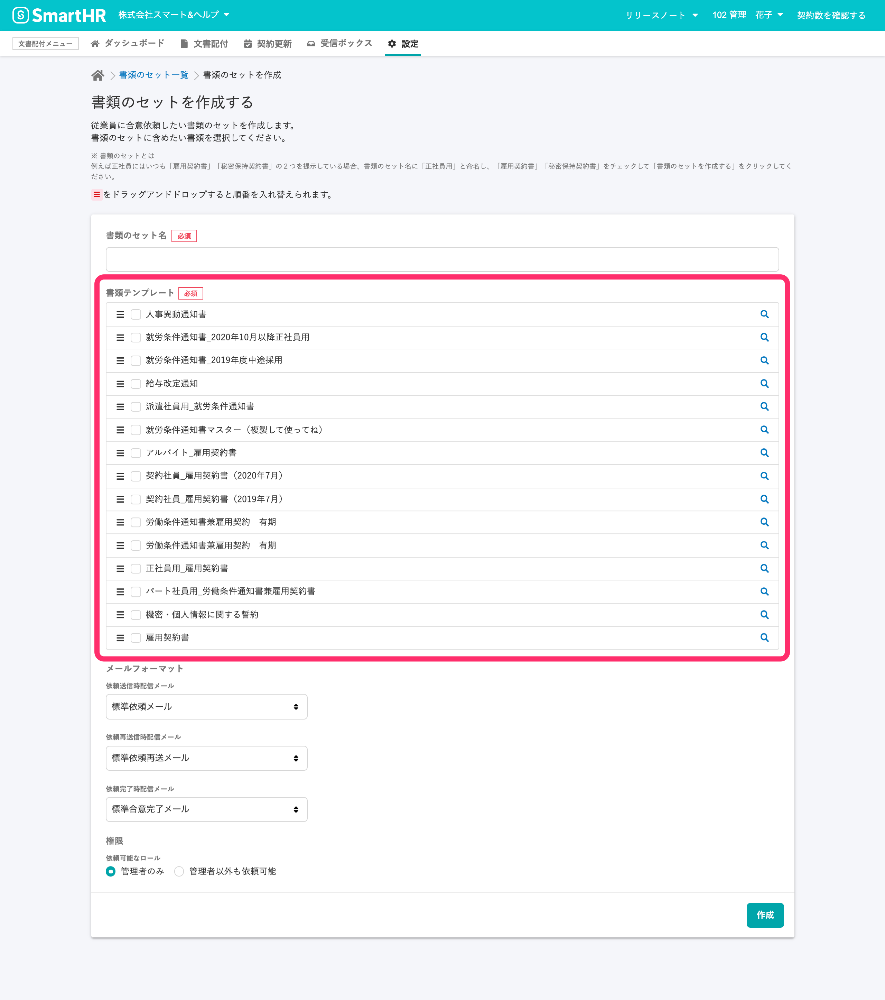

2020年12月3日（木）に行なったアップデートの詳細をお知らせします。

文書配付機能の変更点は、カイゼン2件でした。

# 📈 カイゼン

## 複数の書類の依頼を受け取ったとき、どの書類からでも合意・確認ができるようにしました

これまでは、従業員が複数の書類が含まれる依頼を受け取ったとき、1枚目から順番に合意・確認をしないと、次につづく書類の合意・確認ができない仕様になっていましたが、今回のアップデートで、どの書類からでも合意・確認ができるようになりました。

書類のスキップができるので、「合意できる書類にはすべて合意し、差し戻ししたい書類だけを残した状態で差し戻す」といった対応も可能です。

なお、合意・確認がされていない書類が残っている間は依頼は完了にならない点はこれまでと同じため、完了していない依頼のリマインドや管理方法は変わりません。

:::related
[文書配付機能　複数の書類を受け取ったとき、合意と確認の進め方に変更があります](https://smarthr.jp/update/21739)
:::

## 書類セットの新規作成画面で書類テンプレートが作成日の新しい順に並ぶようにしました

これまで書類セットの新規作成画面で表示される **\[書類テンプレート\]** 一覧の並びは、順序不定のランダムなものでしたが、作成日が新しい順に並ぶよう変更しました。

ヘッダーメニューの**\[設定\]** \> **\[書類のセット\]** \> **\[+書類のセットを作成する\]** から確認できます。

:::related
[書類のセットを作成する](https://knowledge.smarthr.jp/hc/ja/articles/360026263933)
:::
