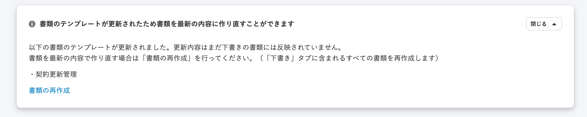
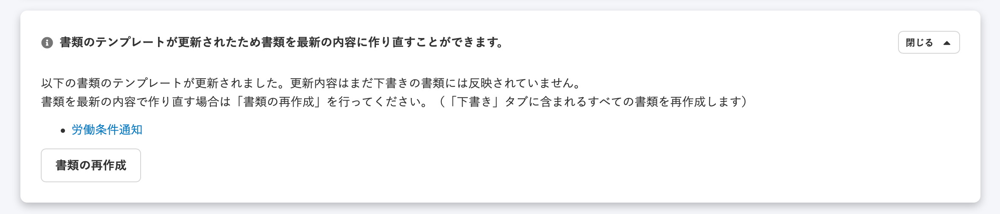

2020年12月4日（金）に行なったアップデートの詳細をお知らせします。

文書配付機能の変更点は、カイゼン1件でした。

# 📈 カイゼン

## 書類再作成パネルの書類テンプレート名をリンクにしました

依頼グループ作成後、そこに含まれる書類テンプレートを更新した際に表示される「書類再作成のパネル」内の表記を下記のとおり変更しました。

- 書類テンプレート名をリンクに変更
- 書類の再作成をボタン表示に変更

| 変更前 |  |
| --- | --- |
| 変更後 |  |

:::related
[書類テンプレートを管理する](https://knowledge.smarthr.jp/hc/ja/articles/360026104474)
:::
