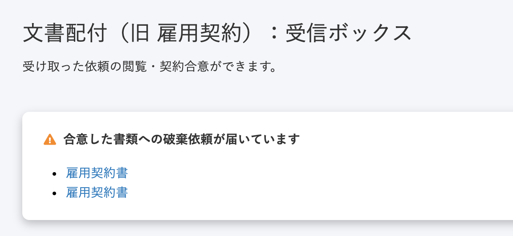
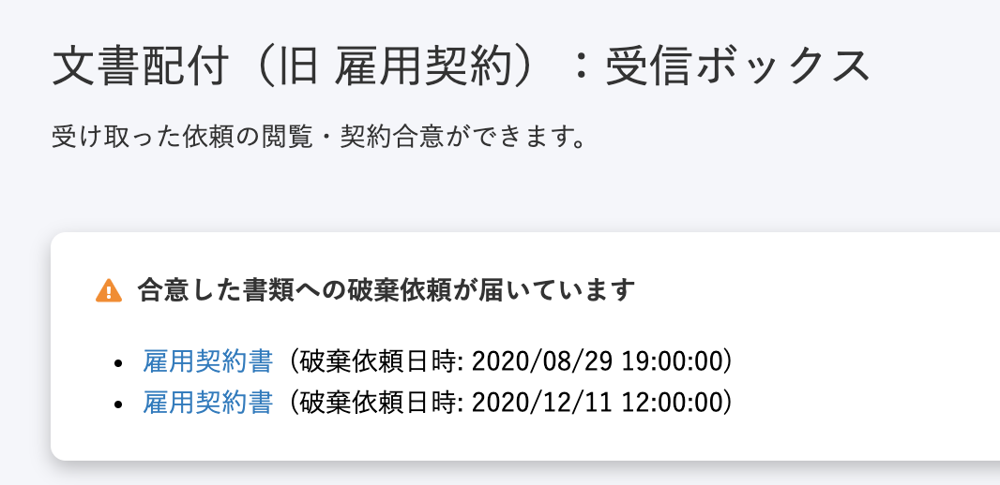

2020年12月7日（月）に行なったアップデートの詳細をお知らせします。

文書配付機能の変更点は、カイゼン1件でした。

# 📈 カイゼン

## 破棄依頼通知パネルの書類名の横に、破棄依頼日時を追加しました

これまでは、「この破棄依頼は、いつ来たものか」という情報は、実際に書類を開くまでわからない状態でした。

そこで今回の改修で、破棄依頼中の書類を持つ従業員の受信ボックスに表示される「破棄依頼通知パネル」に **\[破棄依頼日時\]** を追加しました。

カイゼンの結果、破棄依頼が届いた日からの経過日数がわかるようになり、また、同じ名前の書類に破棄依頼が続いても日時で区別がつくようになりました。

| 変更前 | 変更後 |
| --- | --- |
|  |  |
