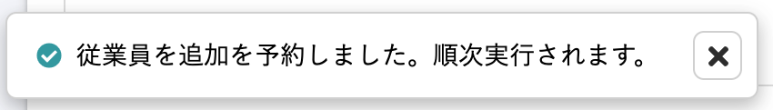
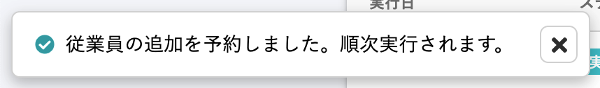
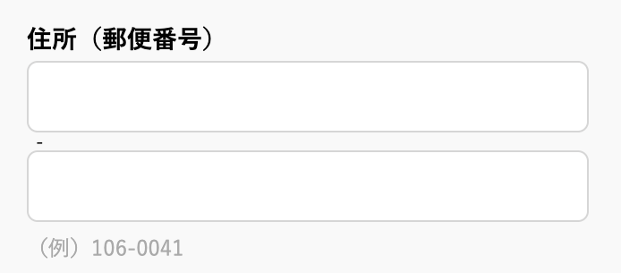
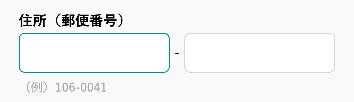
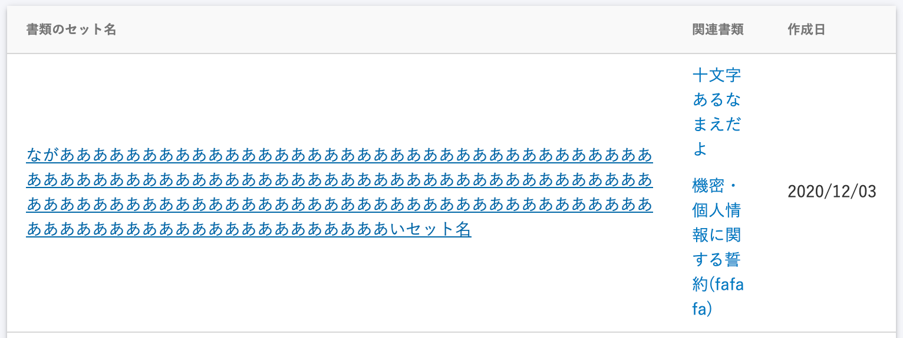
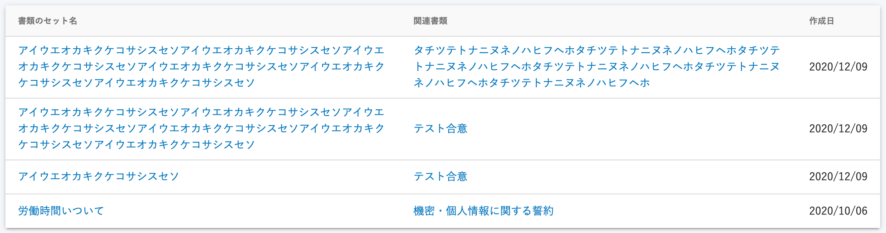

2020年12月8日（火）に行なったアップデートの詳細をお知らせします。

文書配付機能の変更点は、カイゼン1件・アクセシビリティ2件でした。

# 📈 カイゼン

## 依頼対象従業員を一括追加する際に表示されるフラッシュメッセージを変更しました

依頼グループに依頼対象従業員を一括追加する際に表示されるフラッシュメッセージを**\[従業員を追加を予約しました。\]**  から **\[従業員の追加を予約しました。\]** に変更しました。

| 変更前 |  |
| --- | --- |
| 変更後 |  |

:::related
[依頼グループに従業員をまとめて追加する](https://knowledge.smarthr.jp/hc/ja/articles/360043494373)
:::

# 🎢 アクセシビリティ

## 郵便番号の入力フォームを横並びに固定しました

住所セットが含まれた書類テンプレートの郵便番号入力フォームが縦並びになっていたので、横並びに固定しました。

| 変更前 |  |
| --- | --- |
| 変更後 |  |

:::related
[署名時に住所入力も依頼する](https://knowledge.smarthr.jp/hc/ja/articles/360033699433)
:::

## 書類のセット一覧のタイトル表示を整えました

書類のセット一覧で、書類セット名や書類名が長いとタイトル表示が崩れていましたが、今回の改修で読みやすいように表示スタイルを整えました。

| 変更前 |  |
| --- | --- |
| 変更後 |  |
