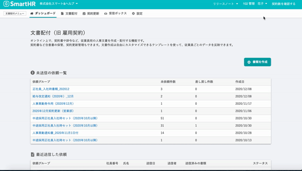
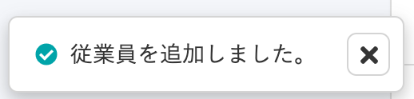

2020年12月10日（木）に行なったアップデートの詳細をお知らせします。

文書配付機能の変更点は、カイゼン2件でした。

# 📈 カイゼン

## 依頼グループの詳細情報を取得するまでの体感速度をカイゼンしました

これまでは、依頼グループをクリックしてから詳細画面に移動する際、すべての情報がそろうまで画面が切り替わりませんでした。

そこで今回の改修で、先に依頼グループ詳細ページに移動し、そのあと情報を取得して詳細を表示する仕様にしました。

詳細取得中は **\[依頼一覧を読み込み中です\]** というメッセージを表示するようにしたため、アクセス自体は正常に行なわれているが、情報取得に時間がかかっていることがわかるようになっています。

## フラッシュメッセージの末尾に句点を追加しました

SmartHR全体での表記ルールに合わせるため、従業員を追加した際などに表示されるフラッシュメッセージは句点を付けるようにしました。

