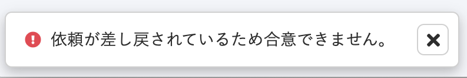
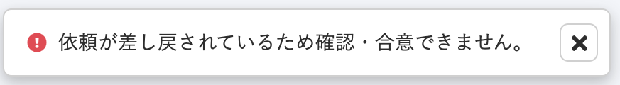

2020年12月11日（金）に行なったアップデートの詳細をお知らせします。

文書配付機能の変更点は、カイゼン1件・不具合修正1件でした。

# 📈 カイゼン

## 差し戻し書類を含んだ依頼の「合意が要らない書類」を確認したときの文言を変更しました

差し戻し書類を含んだ依頼の中で、ほかの「合意がいらない書類」を確認しようとしたときのメッセージを、 **\[依頼が差し戻されているため合意できません\]** から **\[依頼が差し戻されているため確認・合意できません\]** に変更しました。

合意が必要な書類と合意が不要な書類、どちらでも違和感のないメッセージにするのが目的です。

| 変更前 | 変更後 |
| --- | --- |
|  |  |

# 👨‍⚕️ 不具合修正

大量の従業員依頼グループでの書類の再作成をした際の挙動に関する1件の不具合修正を行ないました。
