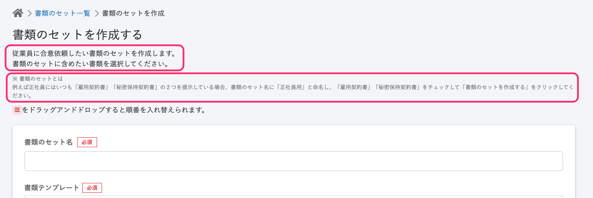
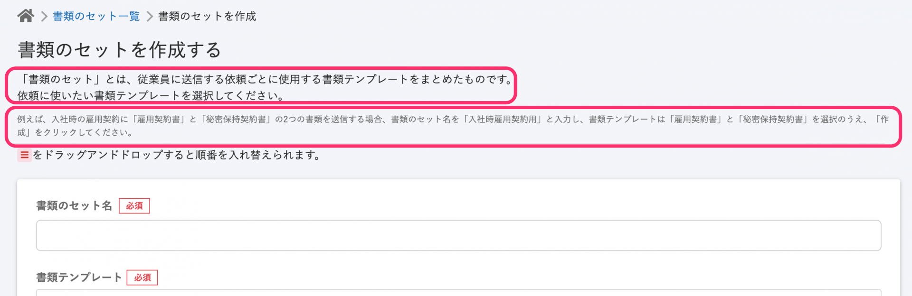
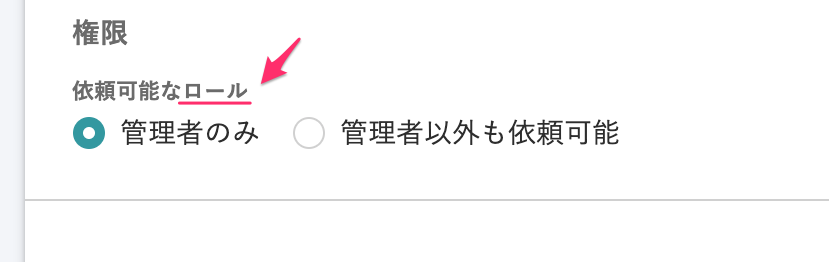
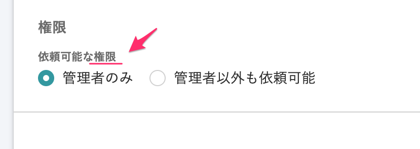

2020年12月14日（月）に行なったアップデートの詳細をお知らせします。

文書配付機能の変更点は、カイゼン1件でした。

# 📈 カイゼン

## 書類のセット作成画面の文言を変更しました

**\[書類のセット\] > \[+書類のセットを作成する\]** 画面の文言を下記のとおり変更しました。

① 画面上部にある書類のセットについての説明文を、現在の文書配付機能に合わせた表現にし「書類のセットとは」を明確に定義した内容に変更しました。

**変更前**

- 従業員に合意依頼したい書類セットを作成します。書類のセットに含めたい書類を選択してください。
- ※書類のセットとは　例えば正社員にはいつも「雇用契約書」「秘密保持契約書」の2つを提示している場合、書類のセット名に「正社員用」と命名し、「雇用契約書」「秘密保持契約書」をチェックして「書類のセットを作成する」をクリックしてください。

**変更後**

- 「書類のセット」とは、従業員に送信する依頼ごとに使用する書類テンプレートをまとめたものです。依頼に使いたい書類テンプレートを選択してください。
-  例えば、入社の雇用契約に「雇用契約書」と「秘密保持契約書」の2つの書類を送信する場合、書類のセット名を「入社時雇用契約用」と入力し、書類テンプレートは「雇用契約書」と「秘密保持契約書」を選択のうえ、「作成」をクリックしてください。

| 変更前 |  |
| --- | --- |
| 変更後 |  |

② SmartHR全体での表記ルールに合わせるため、画面下の **\[権限\]** 項目の文言を **\[依頼可能なロール\]** から **\[依頼可能な権限\]** に変更しました。

| 変更前 |  |
| --- | --- |
| 変更後 |  |

:::related
[書類のセットを作成する](https://knowledge.smarthr.jp/hc/ja/articles/360026263933)
:::
