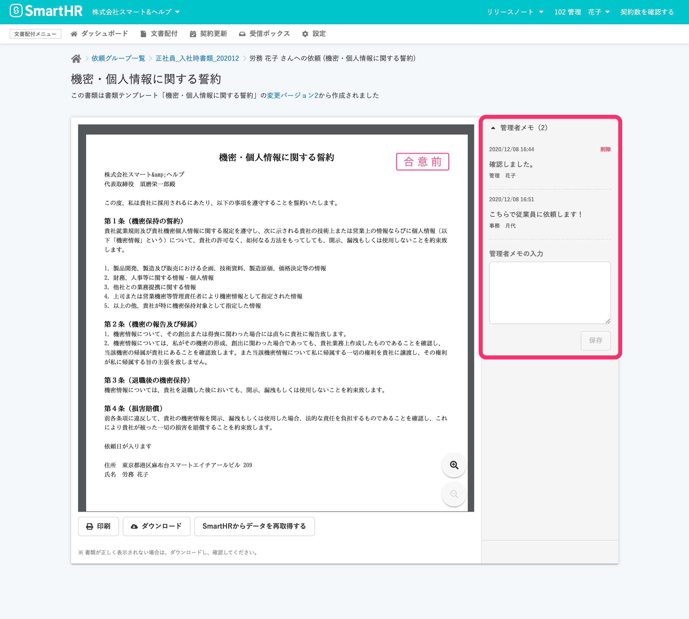
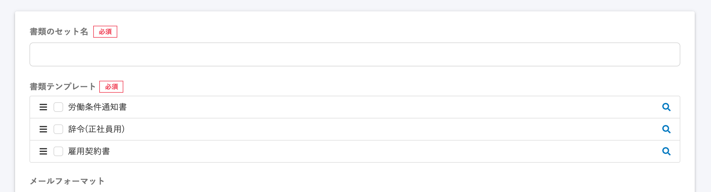
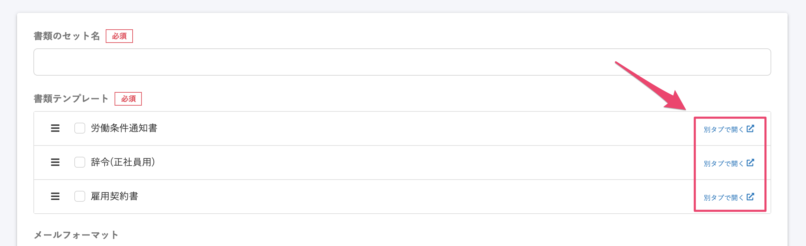

2020年12月15日（火）に行なったアップデートの詳細をお知らせします。

文書配付機能の変更点は、新機能1件・カイゼン1件でした。

# ✨ 新機能

## 書類に「管理者メモ」を残せるようにしました

管理者、または該当の書類に共同管理権限を付与している従業員がメモを作成・削除できるようになりました。

メモは書類単位で入力できます。

また、書類がどのステータスにあってもメモを登録できます。

メモの数に上限はなく、作成された順に残っていきます。

:::related
[【文書配付機能】書類に注意書きや確認したことのメモを作成できるようになります](https://smarthr.jp/update/22119)
:::

注意書きを残しておきたい場合や、複数の管理者や共同管理権限を付与している従業員の間で、確認した内容や質問などを記録として保持できます。

:::related
[管理者権限以外のアカウントで文書配付機能を利用する](https://knowledge.smarthr.jp/hc/ja/articles/360026103954)
:::

# 📈 カイゼン

## 書類のセット作成時、書類テンプレートを確認するリンクを別タブで開くようにしました

これまでは書類テンプレートの詳細を確認する際に虫眼鏡アイコンをクリックすると、同じタブで詳細ページに移動していました。

そのため、ブラウザバックで書類のセットを作成する画面に戻ると、それまで設定していた並び順やチェックボックスがリセットされた状態になってしまっていました。

今回の改修で、詳細画面を別タブで開くようにし、設定や並び順が初期状態に戻らないよう、挙動をカイゼンしました。

表記は、虫眼鏡アイコンから **\[別タブで開く\]** に変更しています。

| 変更前 |  |
| --- | --- |
| 変更後 |  |

:::related
[書類のセットを作成する](https://knowledge.smarthr.jp/hc/ja/articles/360026263933)
:::
