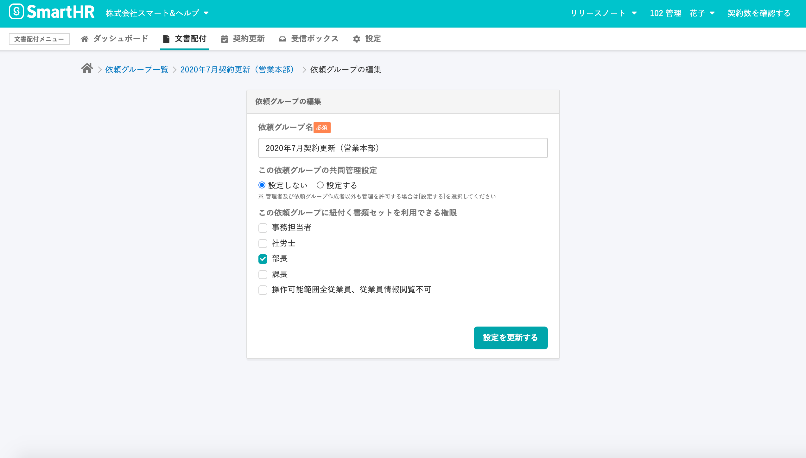

2020年12月21日（月）に行なったアップデートの詳細をお知らせします。

届出書類機能の変更点は、カイゼン3件でした。

# 📈 カイゼン

## 依頼グループ編集画面のレイアウトを変更しました

依頼グループ詳細 画面右上のメニュー > **\[依頼グループを編集する\]** と進むと表示される依頼グループ編集画面のレイアウトやデザインを下記のとおり変更しました。

- パネルを他の画面と合わせた横幅に変更
- **\[必須\]** をSmartHR UIに変更
- **\[設定を更新する\]** → **\[更新\]** に変更

| 変更前 |  |
| --- | --- |
| 変更後 |  |

## メールフォーマット設定の文言を変更しました

メールフォーマット設定の文言を、現在の文書配付機能に合わせた文言に変更しました。

変更箇所と内容は下記のとおりです。

① 依頼グループ詳細 画面右上メニュー > **\[通知メール設定\]** > **\[依頼完了時\]** タブ 画面下

**変更前**

- 合意済み書類の添付設定
- 合意済み書類を添付する
- 確認・合意済み書類のPDFをメールに添付します。
- 確認・合意済み書類のPDFは書類ページからもダウンロードできます。詳しくは、[「合意済みマーク付きの書類は個別にダウンロードする」](https://knowledge.smarthr.jp/hc/ja/articles/1500000540421)をご確認ください。

**変更後**

- 確認・合意済み書類の添付設定
- 確認・合意済み書類を添付する
- 確認・合意済み書類のPDFをメールに添付します。
- 確認・合意済み書類のPDFは書類ページからもダウンロードできます。詳しくは、[「完了済み書類のPDFファイルをダウンロードする」](https://knowledge.smarthr.jp/hc/ja/articles/1500000540421)をご確認ください。

| 変更前 |  |
| --- | --- |
| 変更後 |  |

② **\[設定\]** \> **\[メールフォーマット\]** > **\[+メールフォーマットの作成\]** \> **\[依頼完了時\]** タブ 画面下　と

     **\[メールフォーマット\]** 編集画面 > **\[配信用途\]** > **\[依頼完了時\]** のメールフォーマット

**変更前**

- 合意および確認済み書類の添付設定
- 合意および確認済み書類を添付する
- 合意および確認済み書類のPDFをメールに添付します。
- 書類PDFは書類の詳細ページからもダウンロードできます。 詳しくは、[「合意済みマーク付きの書類は個別にダウンロードする」](https://knowledge.smarthr.jp/hc/ja/articles/1500000540421)をご確認ください。

**変更後**

- 確認・合意済み書類の添付設定
- 確認・合意済み書類を添付する
- 確認・合意済み書類のPDFをメールに添付します。
- 確認・合意済み書類のPDFは書類ページからもダウンロードできます。 詳しくは、[「完了済み書類のPDFファイルをダウンロードする」](https://knowledge.smarthr.jp/hc/ja/articles/1500000540421)をご確認ください。

| 変更前 |  |
| --- | --- |
| 変更後 |  |

:::related
[通知メールのフォーマットを作成・編集する](https://knowledge.smarthr.jp/hc/ja/articles/360043502353)
[メールフォーマットを編集しても、通知メールが更新されないのはなぜ？](https://knowledge.smarthr.jp/hc/ja/articles/360057579973)
:::

## 書類の合意に失敗した際にエラーメッセージを表示するようにしました

これまで1つの書類を複数タブで開き、同時に書類の確認や合意をしようとしたときに、確認・合意に失敗した場合は予期しないエラーが出ていました。

今回の改修で、その場合は適切なメッセージ **\[書類の確認・合意に失敗しました。\]** を表示するようにし、エラー原因が特定できるようにしました。

**エラーメッセージ**

