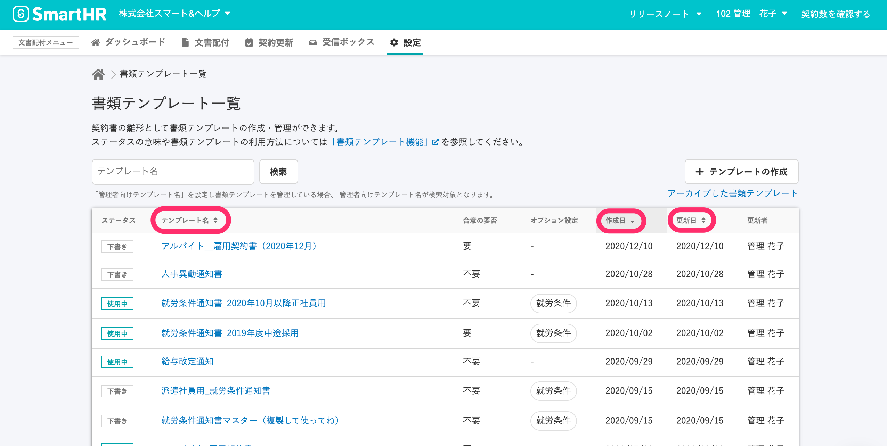

2021年1月18日（月）に行なったアップデートの詳細をお知らせします。

文書配付機能の変更点は、カイゼン1件でした。

# 📈 カイゼン

## 書類テンプレート一覧をタイトル名や日付で並び替えられるようにしました

書類テンプレート一覧で、**\[テンプレート名\] \[作成日\] \[更新日\]** で並び替え表示できるようになりました。

**\[テンプレート名\]** で並び替えると、英数→かな→漢字の順になります。

デフォルト設定では、 **\[作成日\]** の新しい順に一覧が並んでいます。

:::related
[書類テンプレートを管理する](https://knowledge.smarthr.jp/hc/ja/articles/360026104474)
:::

**\[設定\] > \[書類テンプレート\]** > 書類テンプレート一覧の **\[テンプレート名 ↕️\] ／\[作成日 ↕️\] ／\[更新日 ↕️\]** をクリックすると、書類テンプレートを並び替えられます。

