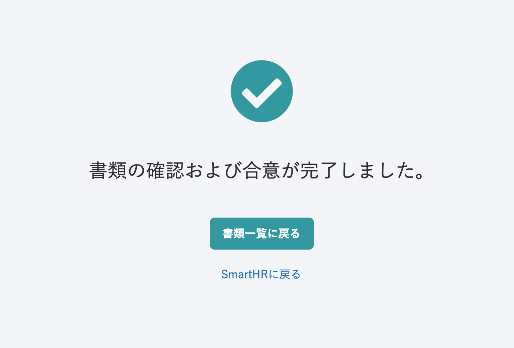
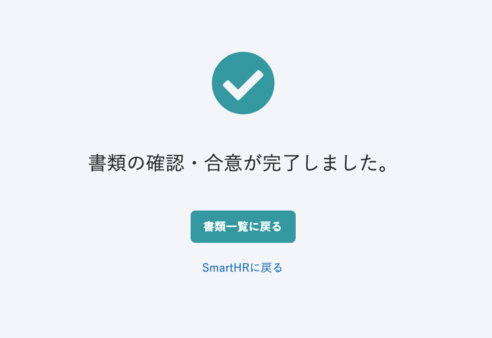
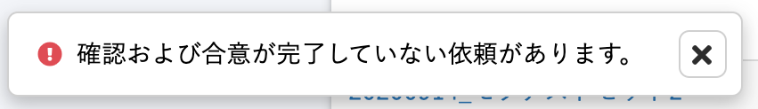
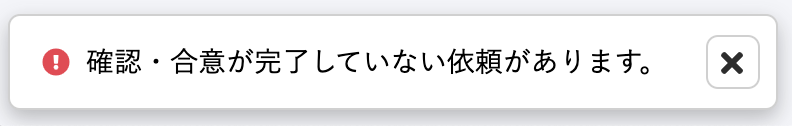

2021年1月25日（月）に行なったアップデートの詳細をお知らせします。

文書配付機能の変更点は、アクセシビリティ2件でした。

# 🎢 アクセシビリティ

## 依頼されたすべての書類に確認・合意した際の文言を変更しました

確認のみの場合、合意のみ場合、確認と合意のどちらもある場合のすべてに対応するため、依頼されているすべての書類を確認もしくは合意した際に表示される文言を **\[確認および合意\]** から **\[確認・合意\]** に変更しました。

| 変更前 | 変更後 |
| --- | --- |
|  |  |

また、未確認もしくは未合意の書類がある際に表示されるメッセージも下記のとおり変更しました。

| 変更前 | 変更後 |
| --- | --- |
|  |  |

## アップデートに向けた内部調整を行ないました

今後のアップデートにむけ、依頼グループ詳細画面のアイコンカラーの変更を行ないました。
