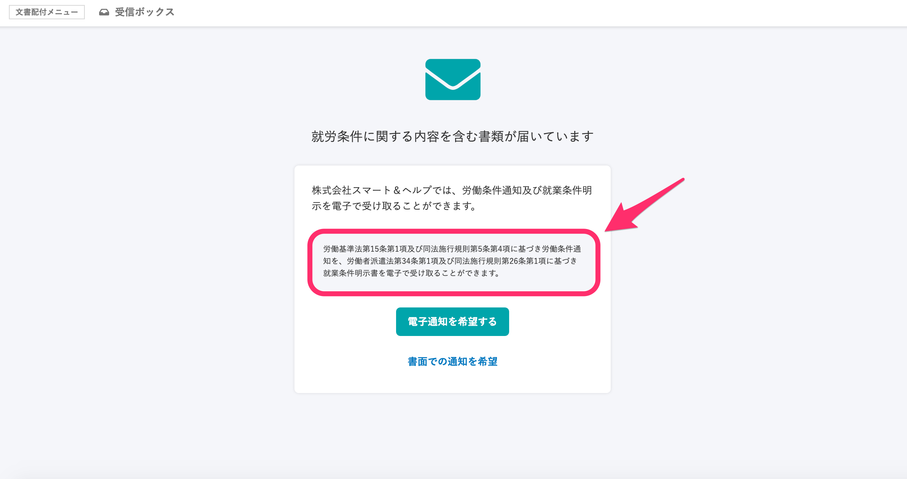
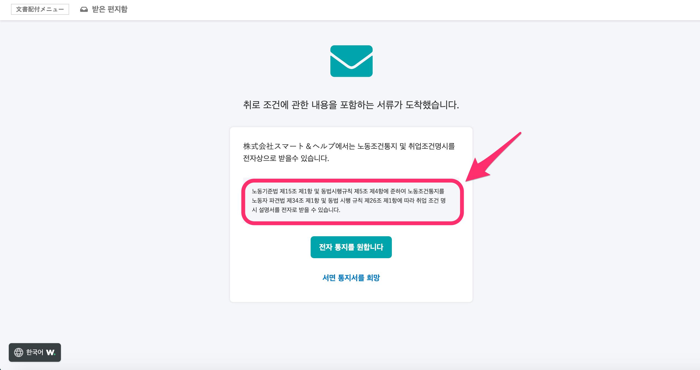

2021年1月28日（木）に行なったアップデートの詳細をお知らせします。

文書配付機能の変更点は、アクセシビリティ1件でした。

# 🎢 アクセシビリティ

## 就労条件通知を受け取った従業員に表示される労働基準法に関する記述を多言語対応しました

就労条件通知を含む合意依頼を受け取った従業員に表示される画面内の、労働基準法に関する記述を多言語対応しました。

:::related
[就労条件通知を含む書類を送るには](https://knowledge.smarthr.jp/hc/ja/articles/360026262573)
:::

| 日本語 |      |
| --- | --- |
| 韓国語 |  |

多言語対応については、下記のページをご覧ください。

:::related
[多言語化対応について](https://knowledge.smarthr.jp/hc/ja/articles/360035659594)
:::
