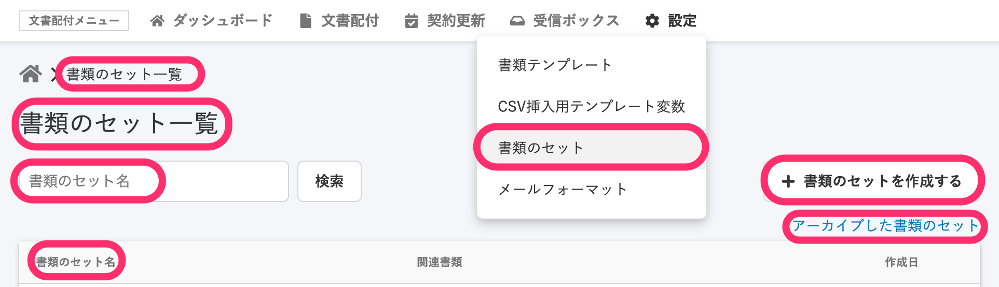
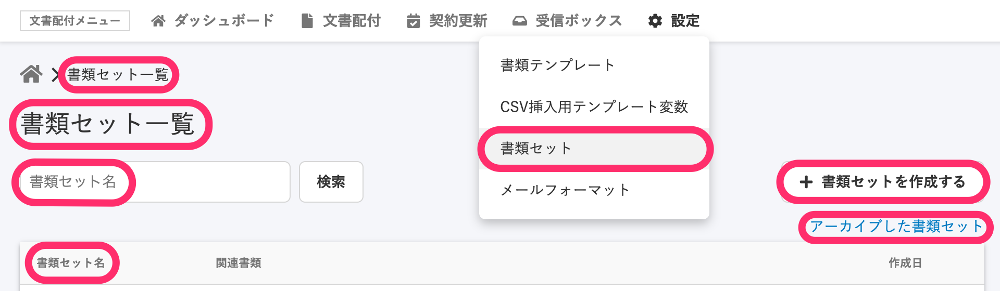

2021年2月3日（水）に行なったアップデートの詳細をお知らせします。

届出書類機能の変更点は、カイゼン1件でした。

# 📈 カイゼン

## \[書類のセット\] を \[書類セット\] に変更しました

文書配付機能で使われていた **\[書類のセット\]** という文言を、表記を統一させるため **\[書類セット\]** に変更しました。

例：書類セット一覧画面

| 変更前 |  |
| --- | --- |
| 変更後 |  |
