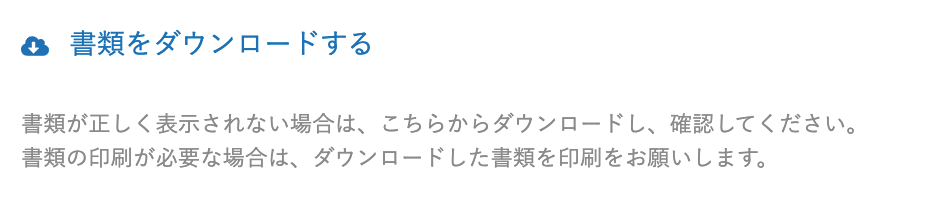
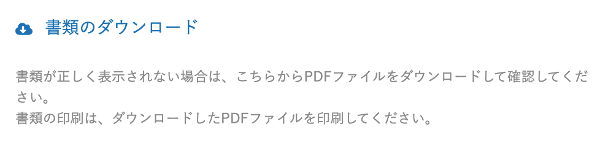
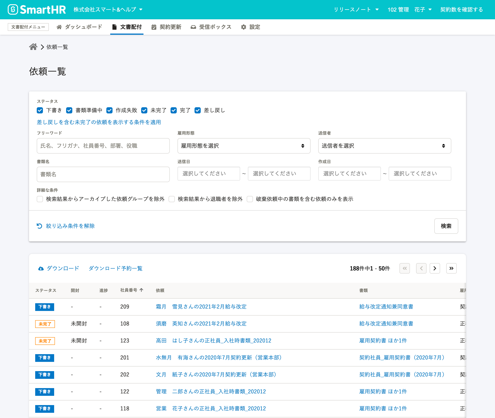

2021年2月17日（水）に行なったアップデートの詳細をお知らせします。

文書配付機能の変更点は、カイゼン1件・アクセシビリティ1件でした。

# 📈 カイゼン

## 書類詳細画面の書類ダウンロードの注記文言を変更しました

書類詳細画面の書類ダウンロードに関する注記をわかりやすくするため、下図のとおりに変更しました。

| 変更前 | 変更後 |
| --- | --- |
|  |  |

# 🎢 アクセシビリティ

## 画面のカラーを新しくしました

視認性向上の取り組みの一環で、文書配付機能画面を新しいカラーにしました。

:::related
[SmartHRの画面のカラーが新しくなります](https://smarthr.jp/update/21763)
:::

