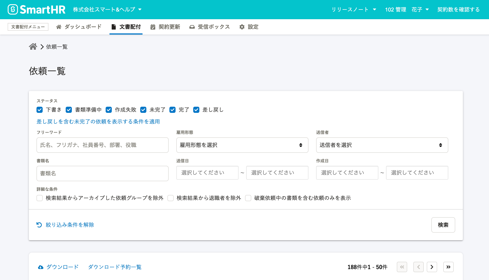
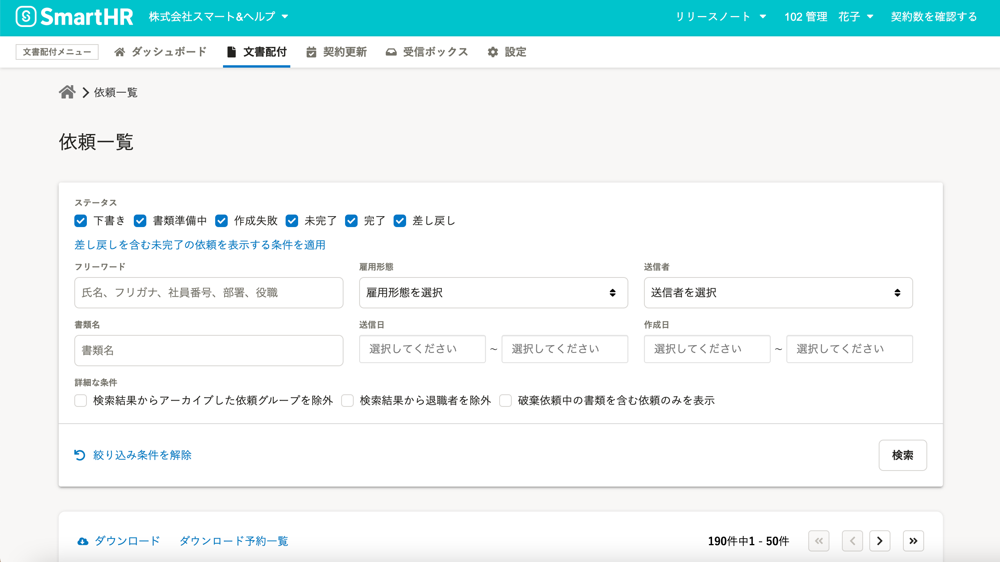

2021年3月2日（火）に行なったアップデートの詳細をお知らせします。

文書配付機能の変更点は、アクセシビリティ1件でした。

# 🎢 アクセシビリティ

## 背景を新しいカラーに変更しました

アクセシビリティ向上のため、文書配布機能の背景を新しいカラーに変更しました。

:::related
[SmartHRの画面のカラーが新しくなりました](https://smarthr.jp/update/21763)
:::

| 変更前 |  |
| --- | --- |
| 変更後 |  |
