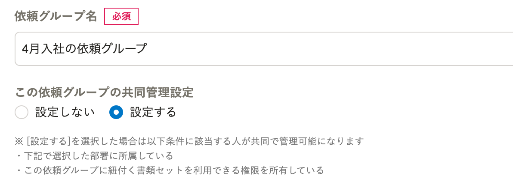
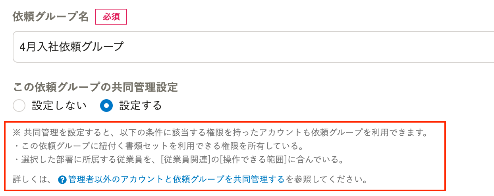

2021年3月19日（金）に行なったアップデートの詳細をお知らせします。

文書配付機能の変更点は、カイゼン1件でした。

# 📈 カイゼン

## 依頼グループの共同管理設定の説明箇所をわかりやすくしました

依頼グループ編集画面 > **［この依頼グループの共同管理設定］** を **［設定する］** にした際に表示される説明文を、下図のとおり変更しました。

ヘルプページへのリンクも追加しています。

:::related
[管理者以外のアカウントと依頼グループを共同管理する](https://knowledge.smarthr.jp/hc/ja/articles/360026262613)
:::

| 変更前 |  |
| --- | --- |
| 変更後 |  |
