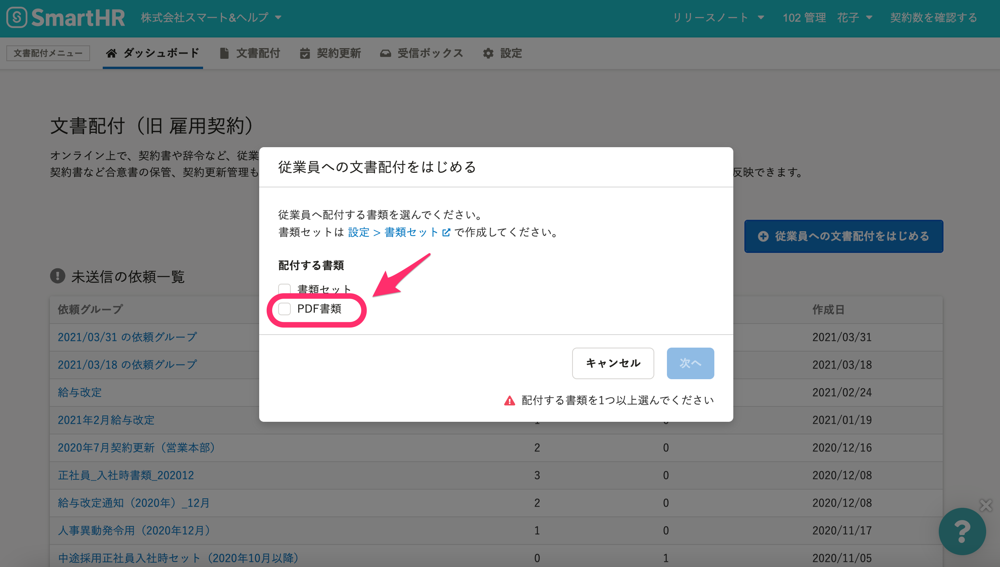
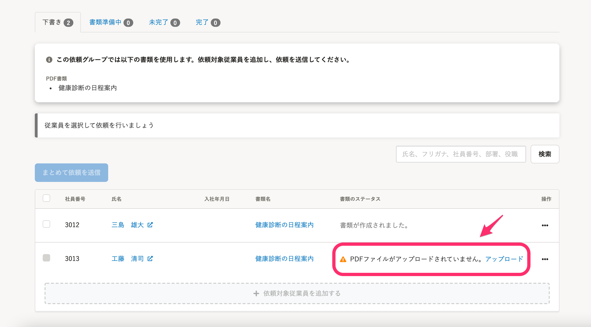
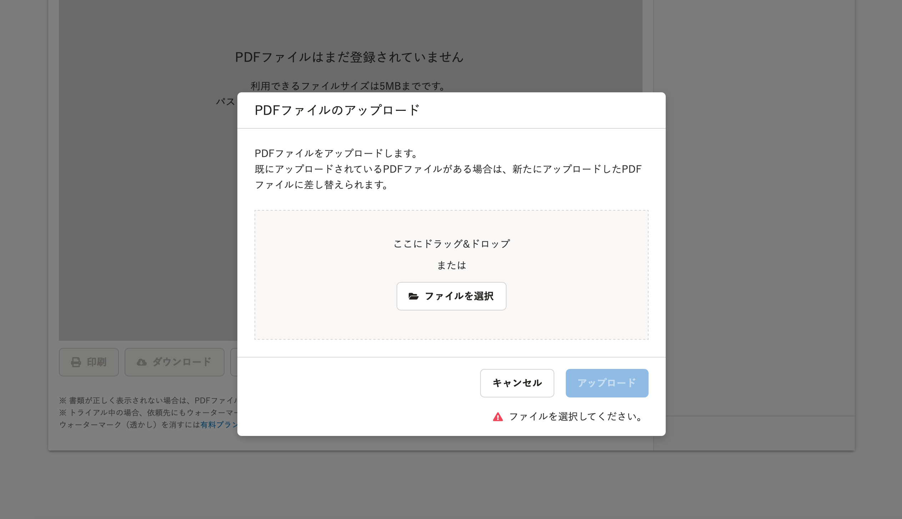

2021年3月31日（水）に行なったアップデートの詳細をお知らせします。

文書配付機能の変更点は、新機能1件でした。

# ✨ 新機能

## SmartHR以外で作成したPDFファイルを配付できるようにしました

これまでは、書類を配付するには **［書類テンプレート］** の作成が必要でしたが、今回のアップデートで、SmartHR以外で作成した**PDFファイル**をそのまま従業員に配付できるようにしました。

:::related
[【文書配付】本機能以外で作成したPDFファイルを配付できるようになりました](https://smarthr.jp/update/24004)
:::

詳しい操作方法は、下記のヘルプページをご覧ください。

:::related
[既存のPDFファイルを書類として送信する](https://knowledge.smarthr.jp/hc/ja/articles/900005440846)
:::

 **［従業員への文書配付をはじめる］** の配付する書類の選択画面

 **［依頼グループ］** 詳細画面

 **［PDFファイルのアップロード］** 画面

