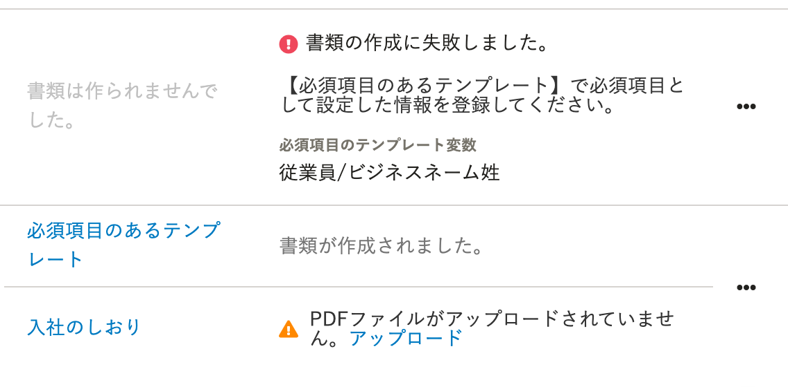
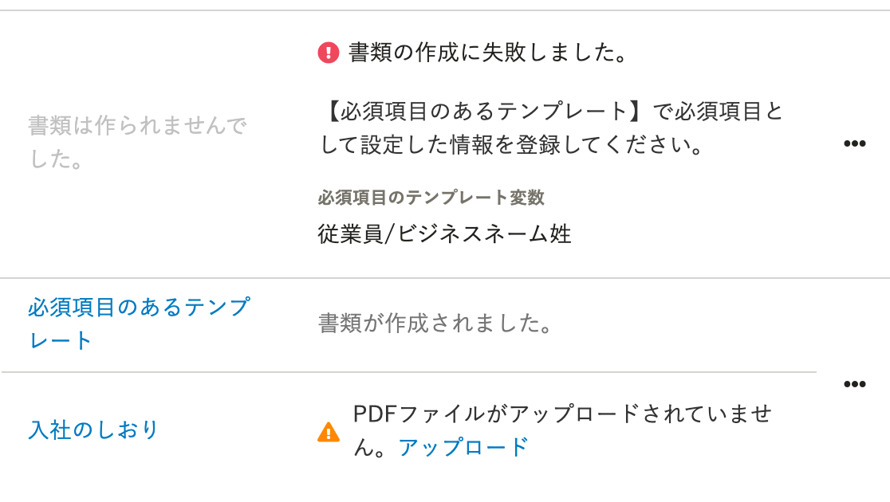

2021年4月2日（金）に行なったアップデートの詳細をお知らせします。

文書配付機能の変更点は、カイゼン1件でした。

# 📈 カイゼン

## ［書類のステータス］の行間を調整しました

依頼グループ一覧の詳細画面 > **［書類のステータス］** が、2行になると行間が詰まって読みにくかったため、今回の改修で行間を広げました。

| 変更前 |  |
| --- | --- |
| 変更後 |  |
