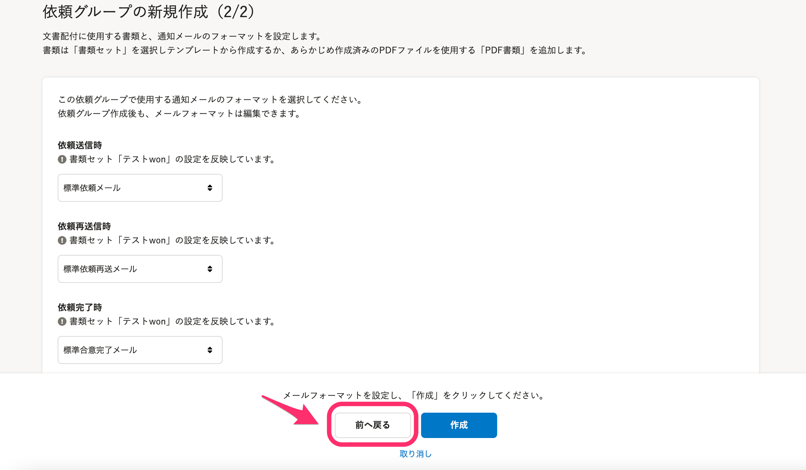
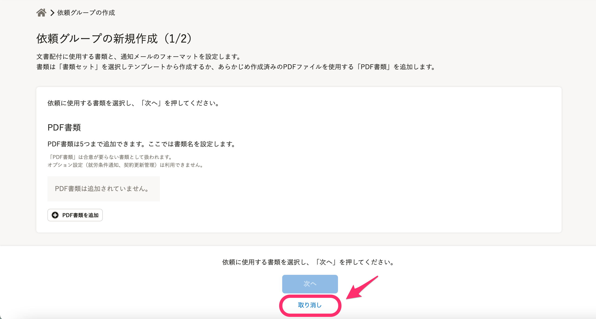
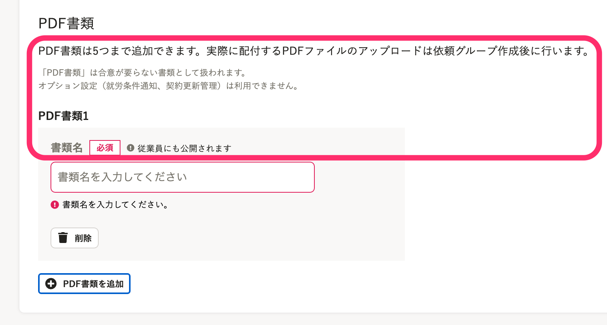
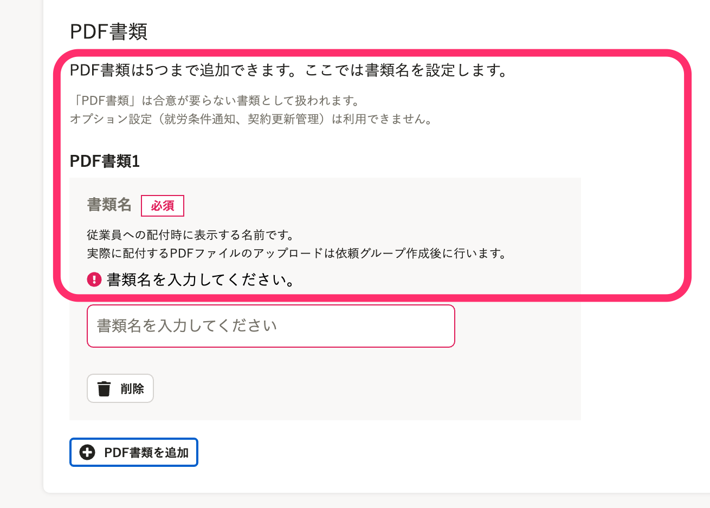
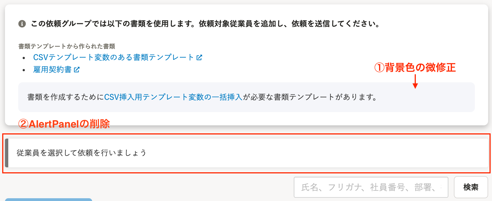
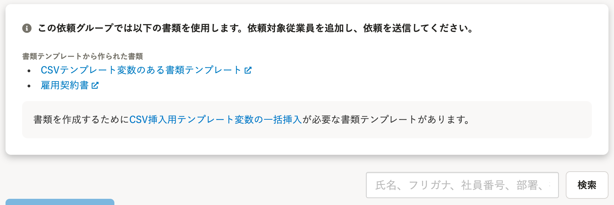
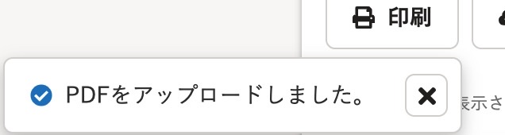
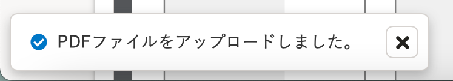
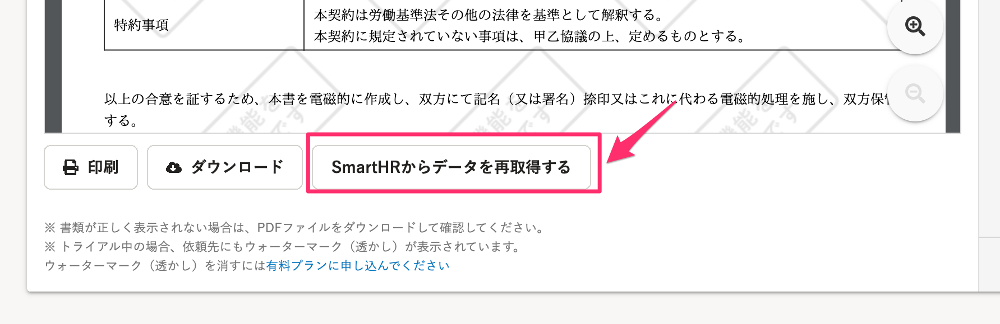
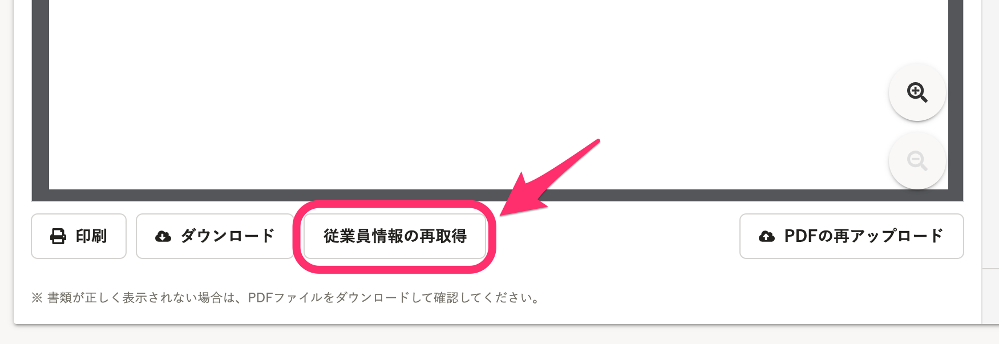

2021年4月7日（水）に行なったアップデートの詳細をお知らせします。

文書配付機能の変更点は、カイゼン6件でした。

# 📈 カイゼン

## 依頼グループの新規作成で「メールフォーマット選択」画面から「書類セット選択」画面へ戻れるようにしました

依頼グループの新規作成で、「メールフォーマット選択」画面下に **［前へ戻る］** ボタンを設置し、「書類セット選択」画面へ戻れるようにしました。

## 依頼グループ新規作成の最初のページで［取り消し］を行なえるようにしました

依頼グループ新規作成の最初の画面に **［取り消し］** ボタンを設置し、新規作成を取り消しできるようにしました。

## 依頼グループ新規作成で、［PDF書類］設定の文言を変更しました

依頼グループ新規作成画面で、 **［PDF書類］** 設定の文言を下図のとおり変更しました。

| 変更前 |      |
| --- | --- |
| 変更後 |  |

## 依頼グループ詳細のアラートパネルを削除し、画面上部のデザインを変更しました

依頼グループ詳細画面で下記のとおり変更しました。

-  **［従業員を選択して依頼を行いましょう］［まずは依頼を行う従業員を追加しましょう］** のアラートパネルを削除
- 「CSV挿入用テンプレートの一括変更」の文言の背景色をSmartHR UIカラー変更しました

| 変更前 |  |
| --- | --- |
| 変更後 |  |

## 書類詳細画面でPDFをアップロードした際のフラッシュメッセージを変更しました

書類詳細画面でPDFをアップロードした際に表示されるフラッシュメッセージ2つを、下記のとおり変更しました。

-  **［PDFファイルは5MB以下を選択してください。］→［5MBを超えるPDFファイルはアップロードできません。］** 

-  **［PDFをアップロードしました。］→［PDFファイルをアップロードしました。］** 

| 変更前 |  |
| --- | --- |
| 変更後 |  |

## 書類詳細画面のボタン名称を［従業員情報の再取得］に変更しました

書類詳細画面下にある、書類への差し込みデータを更新する際の **［SmartHRからデータを再取得する］** のボタンを **［従業員情報の再取得］** の文言に変更しました。

| 変更前 |  |
| --- | --- |
| 変更後 |  |
