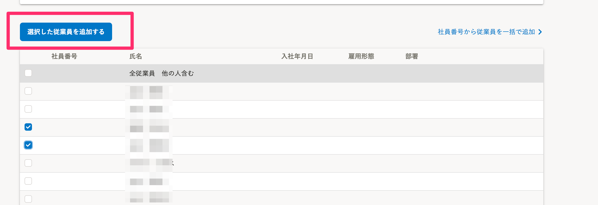
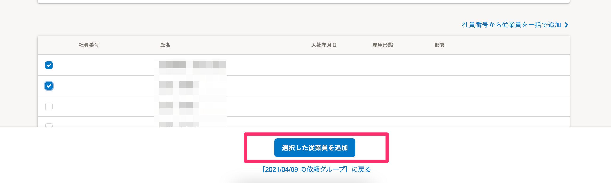

2021年4月12日（火）に行なったアップデートの詳細をお知らせします。

文書配付機能の変更点は、カイゼン1件・不具合修正1件でした。

# 📈 カイゼン

## 従業員を依頼グループに追加するボタンの位置を変更しました

依頼対象従業員の追加画面の **［選択した従業員を追加する］** ボタンの位置を、目に入りやすい画面下に変更しました。

| 変更前 |  |
| --- | --- |
| 変更後 |  |

# 👨‍⚕️ 不具合修正

依頼グループ作成時に、書類名が空だった場合の挙動に関する1件の不具合修正を行ないました。
