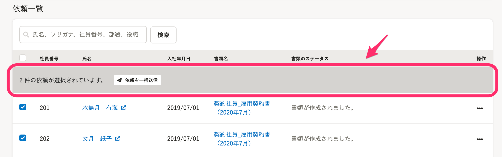
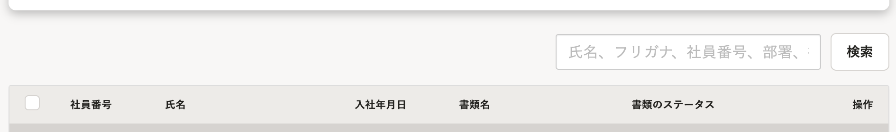
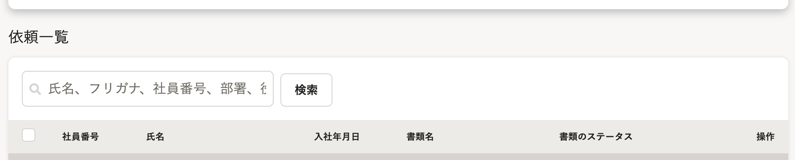
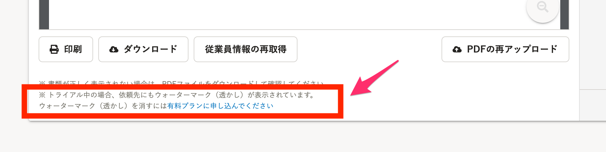
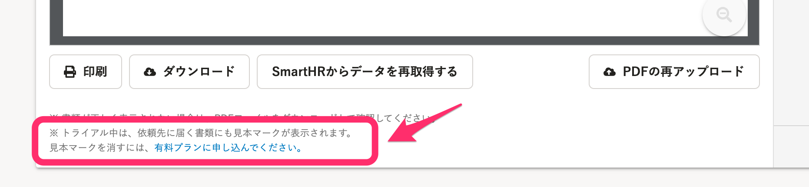

2021年4月21日（水）に行なったアップデートの詳細をお知らせします。

文書配付機能の変更点は、カイゼン3件でした。

# 📈 カイゼン

## 依頼グループ詳細画面の「依頼を一括送信」のデザインを変更しました

依頼グループ詳細画面 > 下書きタブ >  **［依頼一覧］** で、依頼選択した従業員を一括送信する部分を、SmartHR全体のデザインルールに合わせて変更しました。

## 依頼グループ詳細画面の［依頼一覧］のタイトル下に検索フォームを配置しました

依頼グループ詳細画面 > 下書きタブ >  **［依頼一覧］** の検索フォームをタイトル下に配置し、SmartHR全体のデザインルールに合わせました。

| 変更前 |  |
| --- | --- |
| 変更後 |  |

## 書類詳細画面でトライアル中に表示される見本マークに関する注釈を変更しました

書類詳細画面で、文書配付機能のトライアル中に表示される **［見本］** マークに関する注釈文をわかりやすい文言に変更しました。

| 変更前 |  |
| --- | --- |
| 変更後 |      |
