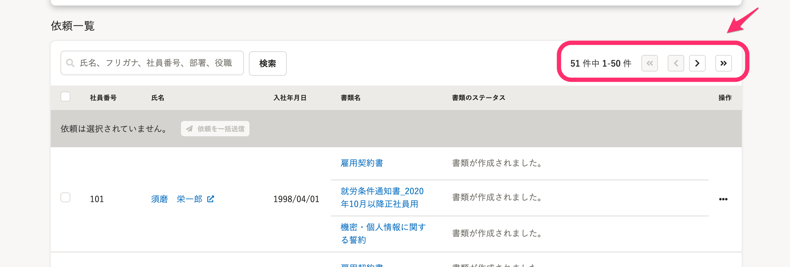

2021年4月22日（木）に行なったアップデートの詳細をお知らせします。

文書配付機能の変更点は、カイゼン1件・不具合修正1件でした。

# 📈 カイゼン

## 依頼一覧のページ移動をしやすくしました

これまでは、依頼グループ内に依頼が51件以上ある場合、2ページ目以降を確認するには画面下までスクロールする手間がありました。

そのためページ移動のリンクを一覧の右上にも設置し、ページの行き来をしやすくしました。

# 👨‍⚕️ 不具合修正

Internet Explorer11で依頼検索をした際の挙動に関する1件の不具合修正を行ないました。
