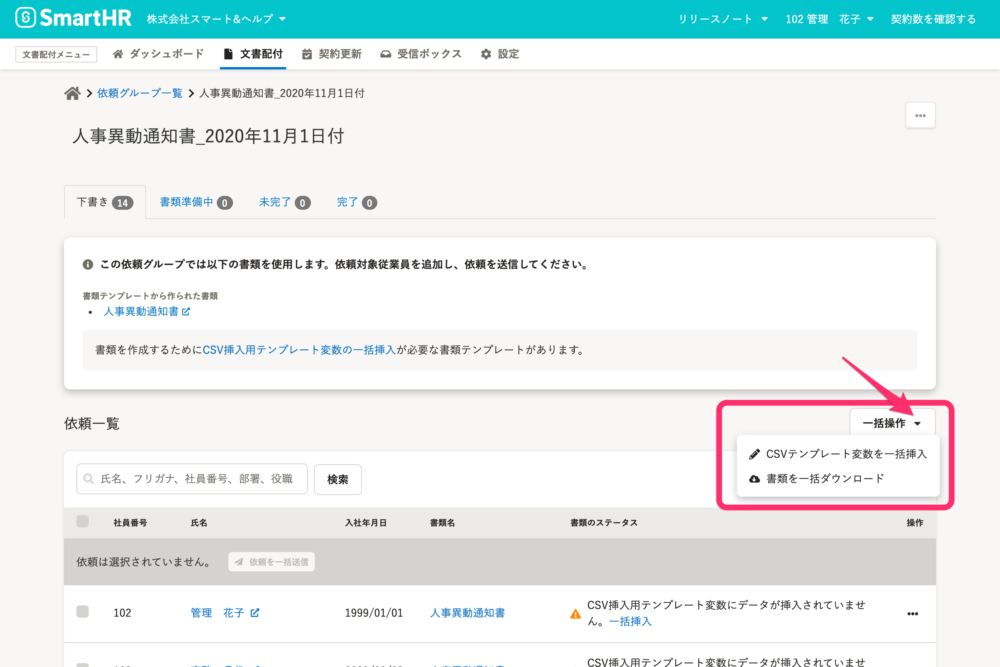

2021年5月6日（木）に行なったアップデートの詳細をお知らせします。

文書配付機能の変更点は、カイゼン1件でした。

# 📈 カイゼン

## 依頼グループ詳細の下書き画面に［一括操作］ボタンを追加しました

依頼グループ詳細 > 下書きタブの **［依頼一覧］** 右肩に **［一括操作］** ボタンを設置し、プルダウンメニューから **［CSVテンプレート変数を一括挿入］・**  **［書類を一括ダウンロード］** を選択できるようにしました。

この変更は管理者権限の場合のみ適用される、今後のリリースに向けたカイゼンになります。

また **［CSVテンプレート変数を一括挿入］・**  **［書類を一括ダウンロード］** は、これまでどおり画面上部の **［…］** メニューからも選択できます。

