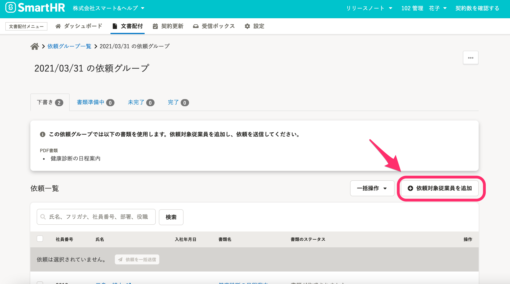

2021年5月14日（木）に行なったアップデートの詳細をお知らせします。

文書配付機能の変更点は、カイゼン1件でした。

# 📈 カイゼン

## 依頼グループ詳細画面にある［依頼対象従業員を追加］ボタンの位置を変更しました

これまでは、依頼グループ詳細画面 の **［依頼対象従業員を追加］** ボタンは依頼一覧の最下部にありましたが、SmartHR全体のデザインルールに合わせるため、依頼一覧の右上にボタンを移動しました。

