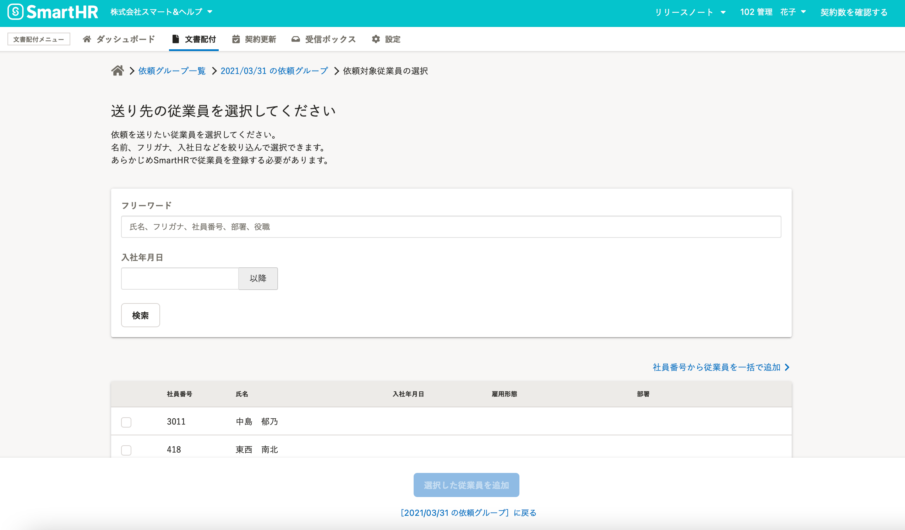
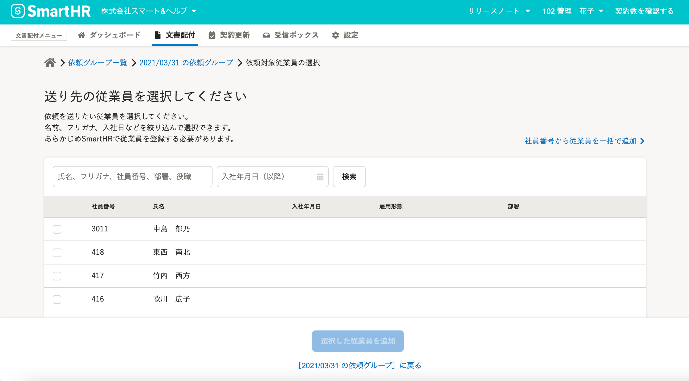

2021年5月14日（金）に行なったアップデートの詳細をお知らせします。

文書配付機能の変更点は、カイゼン1件でした。

# 📈 カイゼン

## 依頼対象従業員の検索フォームのレイアウトを変更しました

送り先の従業員を選択する画面にある、従業員検索フォームのレイアウトをSmartHR全体のデザインルールに合わせたものにし、わかりやすくしました。

| 変更前 |  |
| --- | --- |
| 変更後 |  |
