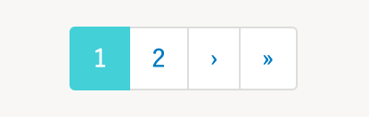
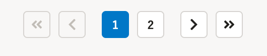

2021年5月20日（木）に行なったアップデートの詳細をお知らせします。

文書配付機能の変更点は、カイゼン1件でした。

# 📈 カイゼン

## 依頼一覧のページ送りのボタンのデザインを変更しました

依頼グループ詳細画面の依頼一覧下部にあるページ送りのボタンのデザインを、SmartHR全体のデザインに合わせて、下図のとおり変更しました。

ページ送りのボタンは、依頼が51件以上の際に表示されます。

| 変更前 | 変更後 |
| --- | --- |
|  |  |
