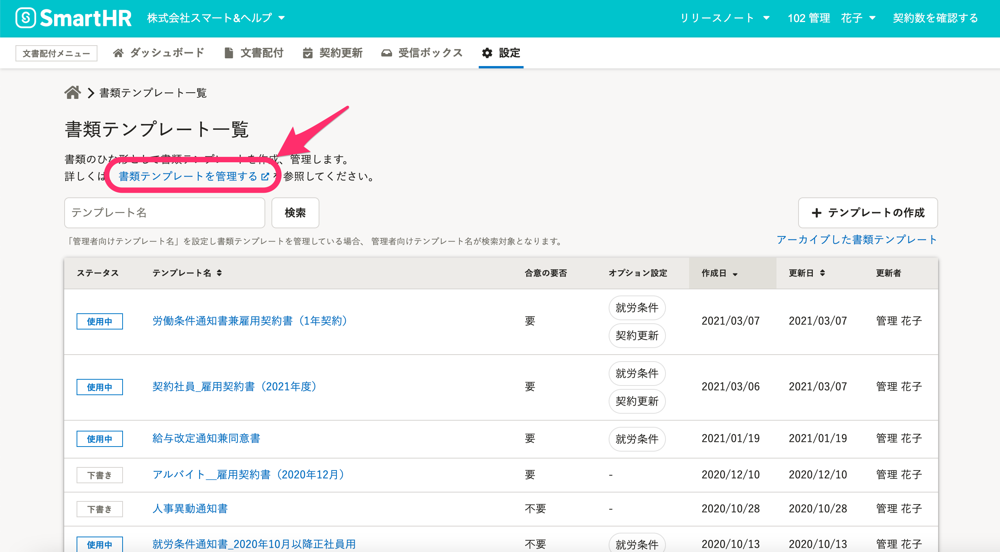
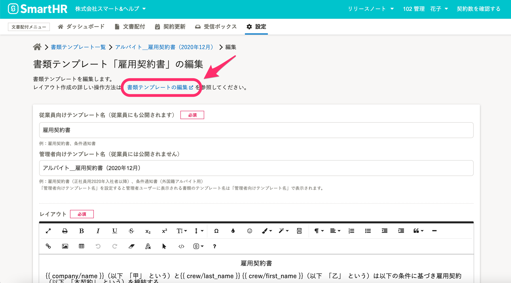

2021年6月2日（水）に行なったアップデートの詳細をお知らせします。

届出書類機能の変更点は、カイゼン1件でした。

# 📈 カイゼン

## 書類テンプレート画面にあるヘルプページへのリンクを変更しました

書類テンプレートに関するヘルプページへの動線を、下記のとおり変更しました。

**書類テンプレート一覧画面**

説明文に、書類テンプレートの概要について説明しているヘルプページ「[書類テンプレートを管理する](https://knowledge.smarthr.jp/hc/ja/articles/360026104474)」へのリンクを設置しました。

**書類テンプレート作成・編集画面**

説明文を追加し、ヘルプページ「[書類テンプレートの編集](https://knowledge.smarthr.jp/hc/ja/sections/360005949333-%E6%9B%B8%E9%A1%9E%E3%83%86%E3%83%B3%E3%83%97%E3%83%AC%E3%83%BC%E3%83%88)」へのリンクを設置しました。

