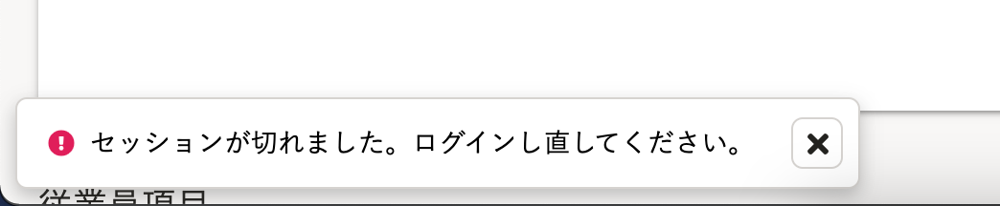

2021年6月4日（金）に行なったアップデートの詳細をお知らせします。

届出書類機能の変更点は、カイゼン1件・不具合修正1件でした。

# 📈 カイゼン

## 操作中にセッションが切れた際、正しいエラーが表示されるようにしました

これまではセッションが切れている（ログアウトしている）状態でAPIの設定などをすると、「予期せぬエラー」が表示されていました。

そのため内部動作を見直し、下記のように適切なエラーが表示されるようにしました。

# 👨‍⚕️ 不具合修正

書類テンプレートでの表の大きさに関する1件の不具合修正を行ないました。
