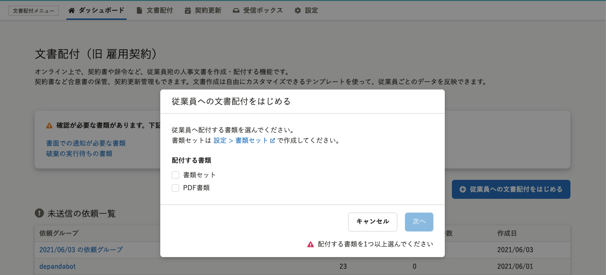
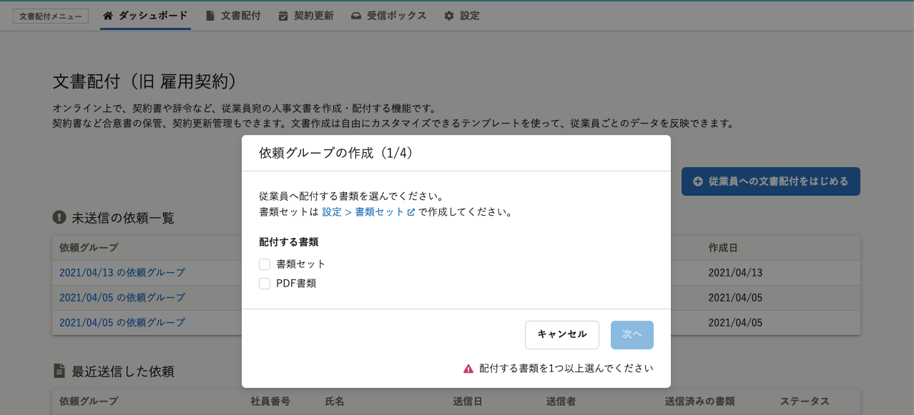
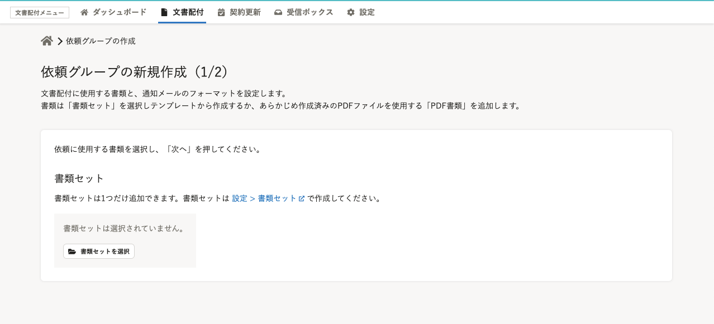
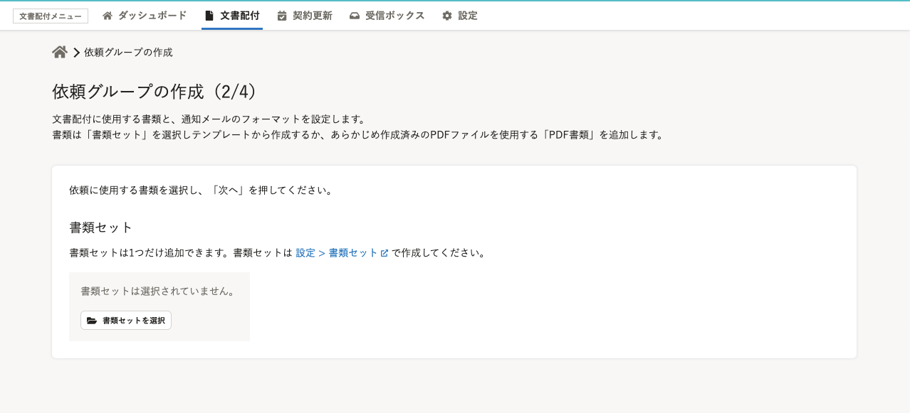
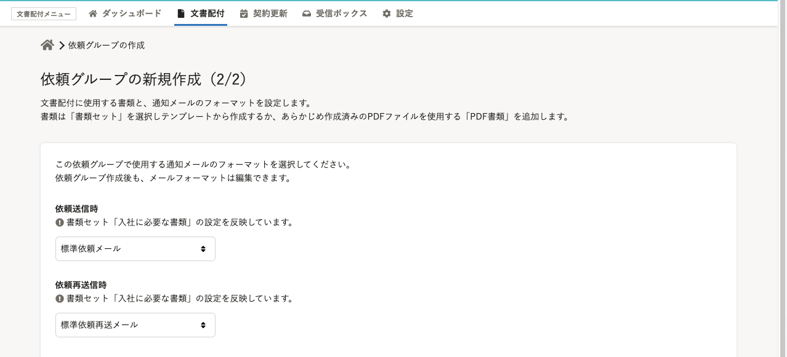
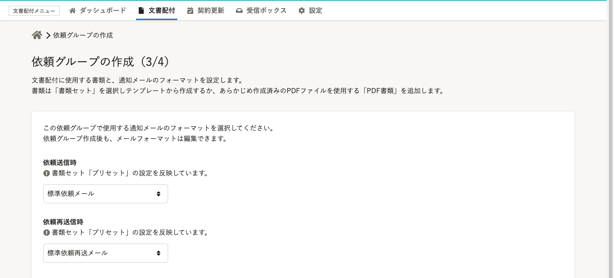
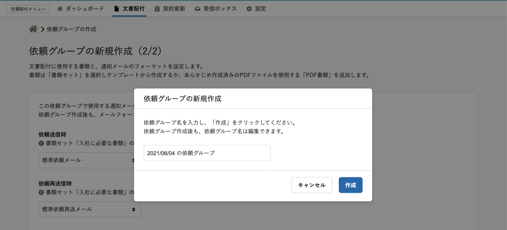
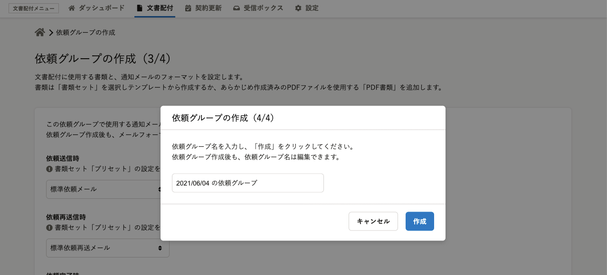
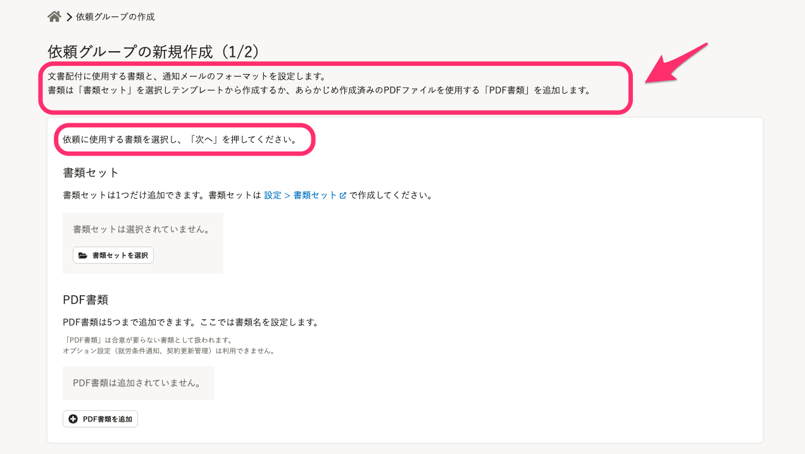
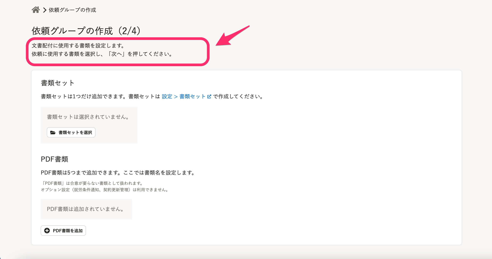

2021年6月9日（水）に行なったアップデートの詳細をお知らせします。

文書配付機能の変更点は、カイゼン3件でした。

# 📈 カイゼン

## 文書配付に関する通知の移動先を受信ボックスにしました

これまでは **［通知履歴］** に表示される文書配付の通知をクリックすると、合意していない一番古い書類画面に移動するようになっていました。

この仕様だと、表示名と移動先が一致していないという混乱をきたすため、文書配付の通知のリンク先を受信ボックスの画面に変更しました。

## 依頼グループ作成画面のタイトルを変更しました

 **［従業員への文書配付をはじめる］** をクリックしたあとの、一連の依頼グループの作成画面のタイトルを変更しました。

（n／4）とステップを表示することで作成過程をわかりやすくしました。

| 変更前 | 変更後 |
| --- | --- |
|  |  |
|  |  |
|  |  |
|  |  |

## 依頼グループ作成画面の説明文を変更しました

依頼グループの作成（2／4）の画面にある説明文を簡潔にし、次の操作がわかりやすくなるようにしました。

| 変更前 | 変更後 |
| --- | --- |
|  |  |
