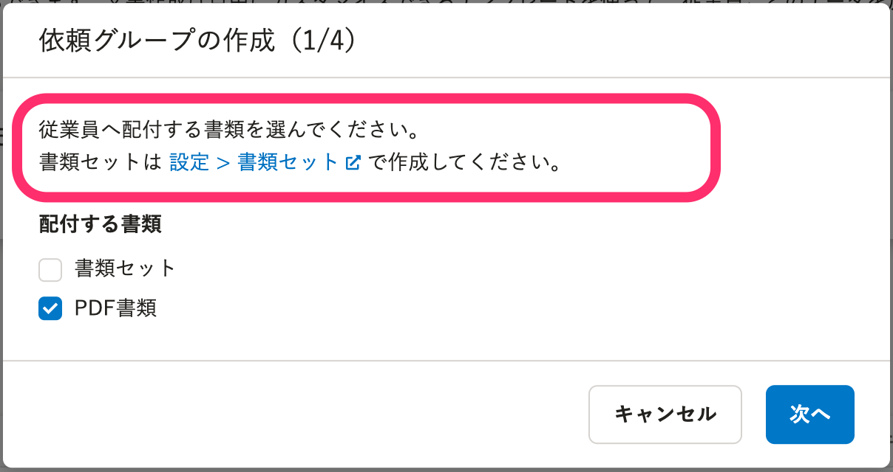
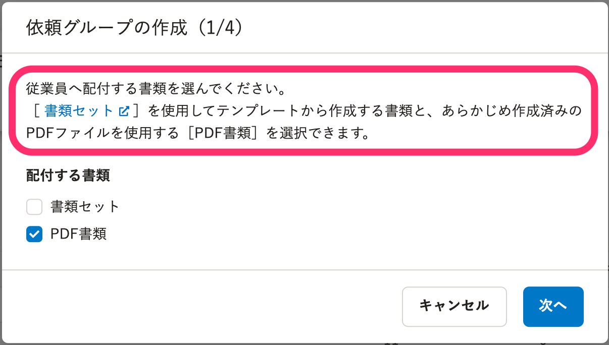
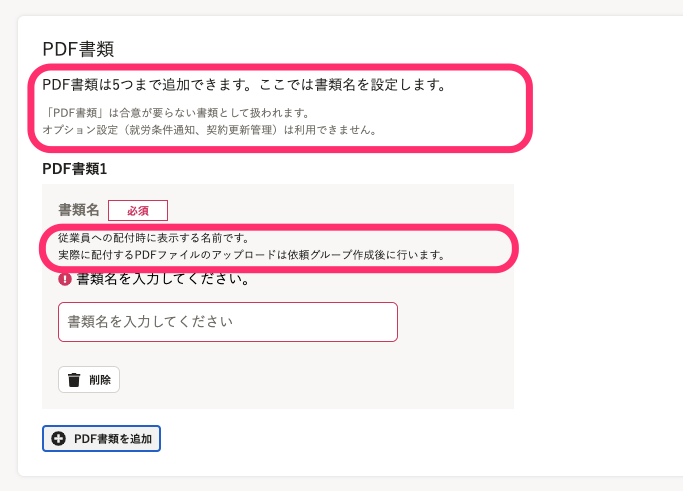
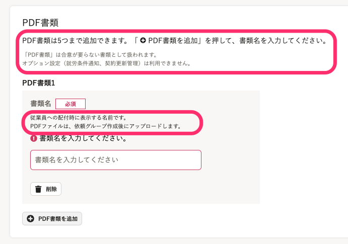
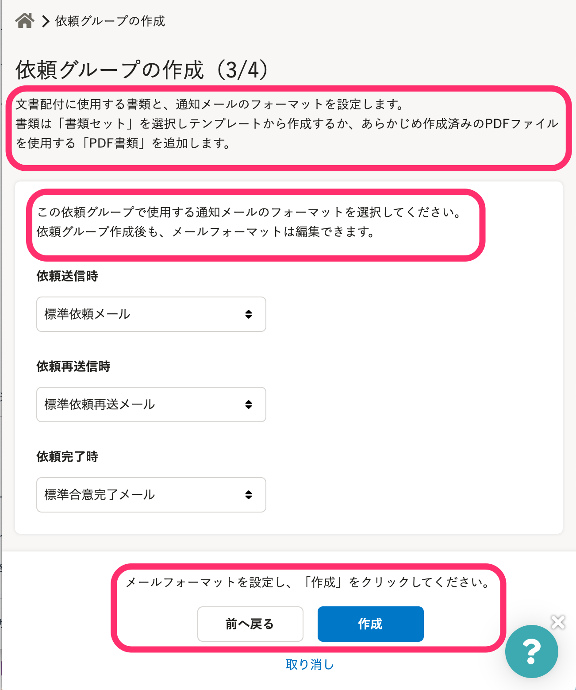
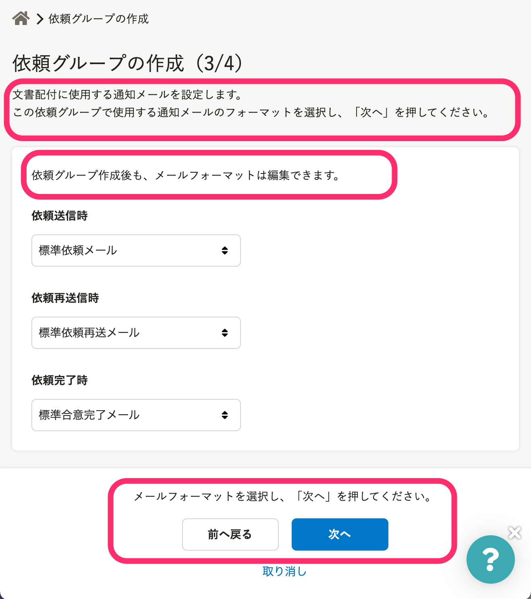
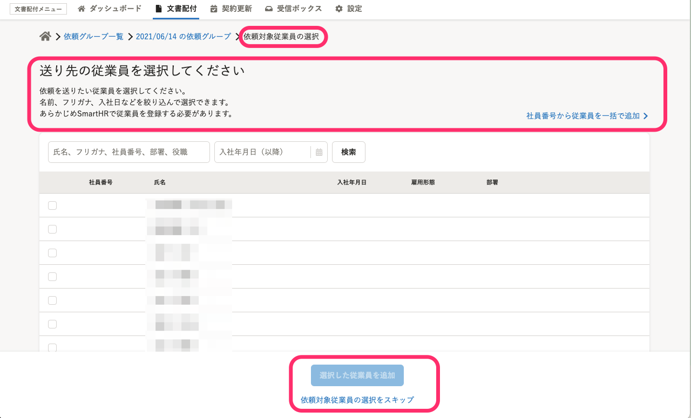
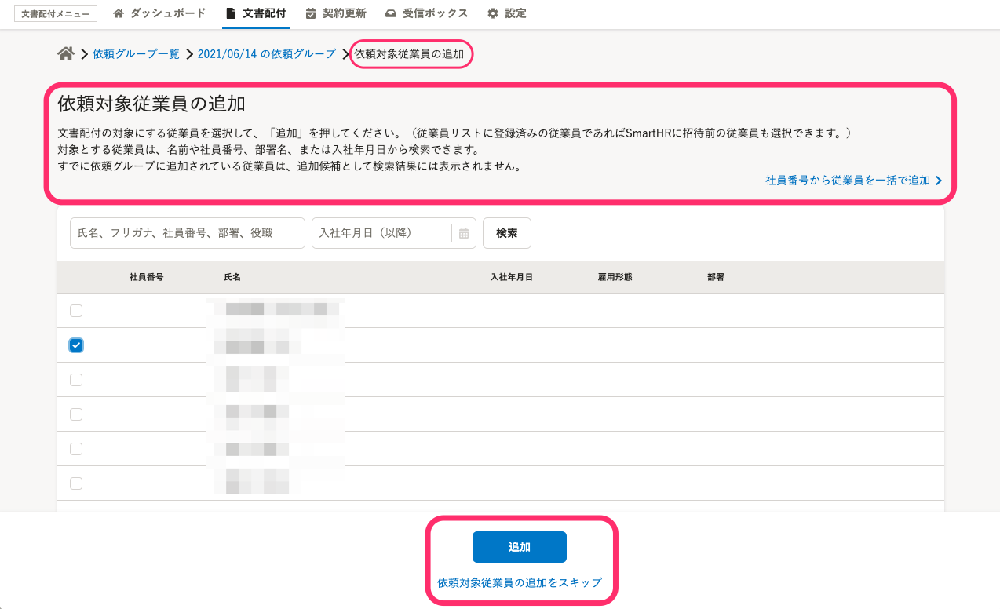

2021年6月17日（木）に行なったアップデートの詳細をお知らせします。

文書配付機能の変更点は、カイゼン1件でした。

# 📈 カイゼン

## 依頼グループ作成画面の文言を変更しました

以下4つの、依頼グループ作成に関わる画面の文言を変更しました。

- 依頼グループの作成（1／4）

依頼グループ作成の際の配付する書類の選択するダイアログで、書類セットとPDF書類の違いをわかるように、本文を修正しました。

| 変更前 | 変更後 |
| --- | --- |
|      |  |

- 依頼グループの作成（2／4）

PDF書類を追加する欄の説明文をSmartHR全体の表記ルールに合わせました。

| 変更前 |   変更後   |
| --- | --- |
|  |  |

- 依頼グループの作成（3／4）画面

通知メール設定画面の説明文とボタンの文言を修正しました。

| 変更前 | 変更後 |
| --- | --- |
|  |  |

- 依頼する従業員を選択する画面

依頼する従業員の選択画面で、ページのタイトル・説明文・画面下のボタンのボタンの文言を修正しました。

| 変更前 | 変更後 |
| --- | --- |
|  |  |
