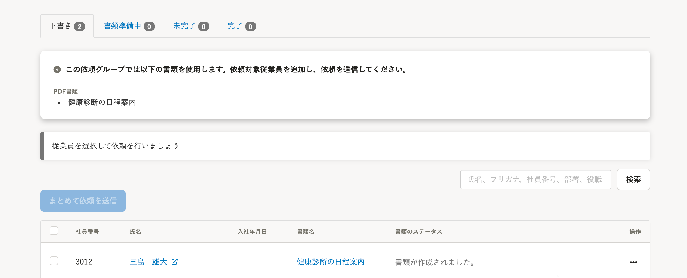
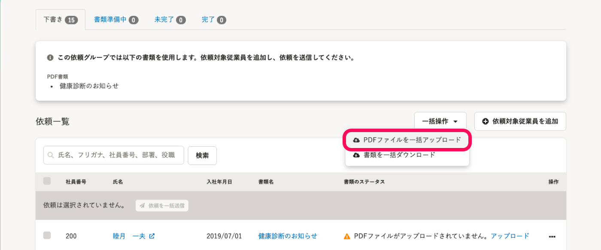

2021年6月30日（水）に行なったアップデートの詳細をお知らせします。

文書配付機能の変更点は、新機能1件でした。

# ✨ 新機能

## PDFファイルを一括アップロードできるようにしました

これまではPDFファイルの書類をアップロードするには、1件ずつ操作する必要がありましたが、一括でPアップロードできるようにしました。

従業員ごとに異なるPDFファイルを登録し、一度にアップロードできます。

詳しい操作方法は下記のヘルプページをご覧ください。

:::related
[PDF書類にPDFファイルをまとめてアップロードする](https://knowledge.smarthr.jp/hc/ja/articles/4402741674393)
[Q. PDFファイルの一括アップロード画面でエラーが表示されたら？](https://knowledge.smarthr.jp/hc/ja/articles/4402948144153)
[Q. 一括アップロードしたPDFファイルを差し替えるには？](https://knowledge.smarthr.jp/hc/ja/articles/4402782759065)
:::

依頼グループにPDF書類が含まれる場合、一括操作のメニュー内に **［PDFファイルを一括アップロード］** が表示されます。

| 変更前 | 変更後 |
| --- | --- |
|  |  |
