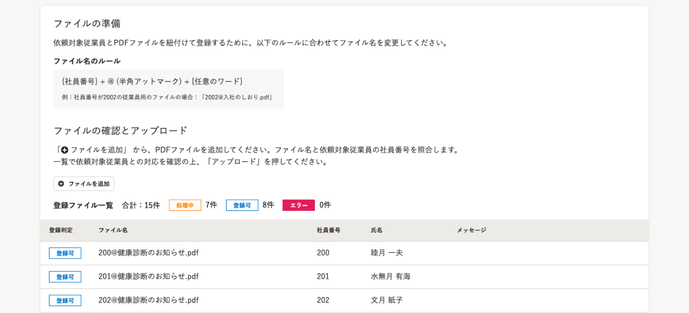
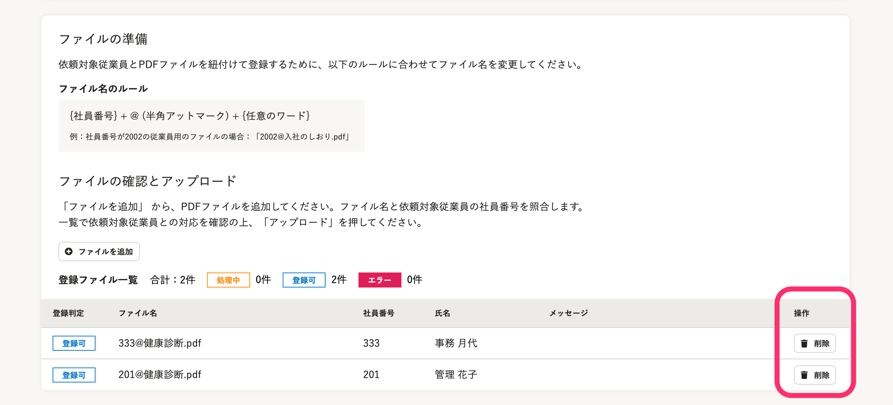
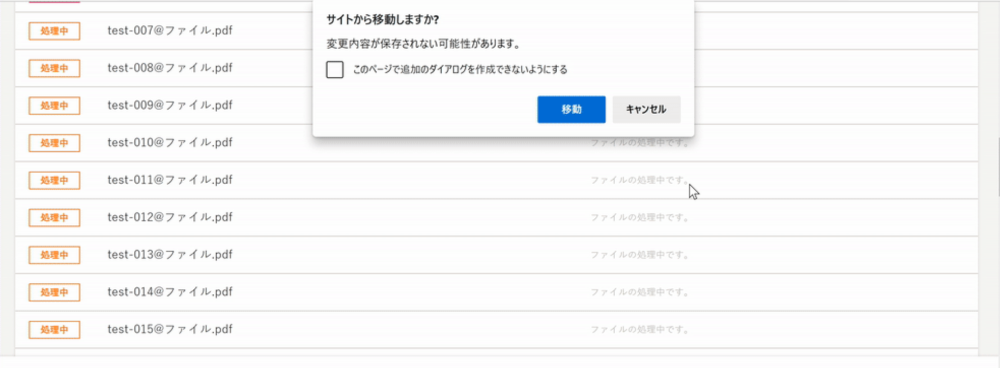

2021年7月6日（火）に行なったアップデートの詳細をお知らせします。

文書配付機能の変更点は、カイゼン2件でした。

# 📈 カイゼン

## アップロードしたPDFファイルを［登録ファイル一覧］から削除できるようにしました

PDFファイルの一括アップロード画面の登録ファイル一覧に、 **［操作］** 項目と **［削除］** ボタンを追加し、ステータスが **［登録可］** または **［エラー］** のファイルを削除できるようにしました。

 **［処理中］** のファイルは削除できません。

| 変更前 | 変更後 |
| --- | --- |
|  |  |

## PDFファイルのアップロードのステータスが［処理中］の際に画面を移動しようとすると、アラートのメッセージを表示するようにしました

PDFファイルを一括アップロードする際にステータスが **［処理中］** の場合は、ブラウザバックや **［取り消し］** をクリックして画面を切り替えようとすると、アラートメッセージを画面上部に表示するようにしました。

アップロードが完了していない状態で、誤って作業を中断しないようにする目的です。

