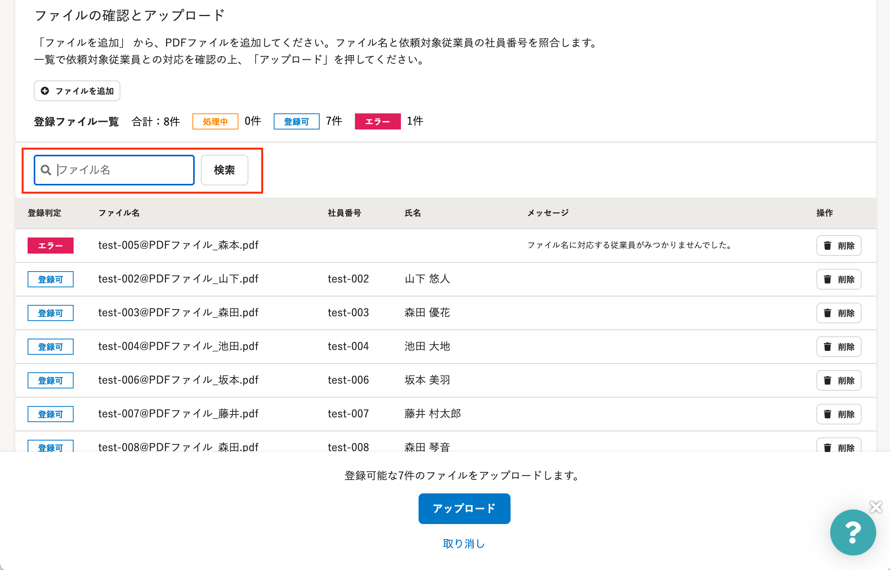
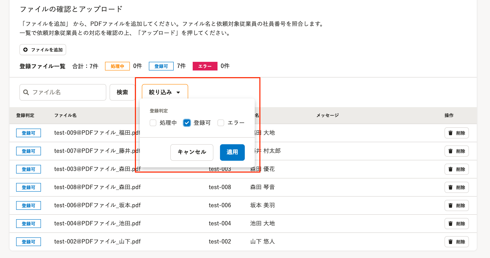

2021年7月28日（水）に行なったアップデートの詳細をお知らせします。

文書配付機能の変更点は、カイゼン2件でした。

# 📈 カイゼン

## 一括アップロードしたPDFファイルをファイル名で検索できるようにしました

PDFファイルの一括アップロード画面で、アップロードしたPDFファイルを検索できるようにしました。

ステータスに関係なく一覧に追加されたファイルが対象となり、ファイル名の部分一致で検索できます。

対象従業員のPDFファイルが追加されているか確認する際や、PDFファイルのステータスを確認する場合などにご利用ください。

## 一括アップロードしたPDFファイルを登録状態で絞り込めるようにしました

PDFファイルの一括アップロード画面で、アップロードしたPDFファイルを **［登録判定］** のステータスで絞り込めるようにしました

「ファイル名の検索」と「ステータスの絞り込み」はAND条件で絞り込み検索できます。

ファイル一覧の上部にある **［絞り込み］** をクリックすると設定できます。

