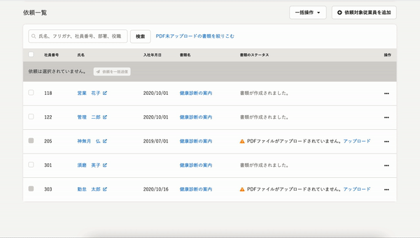
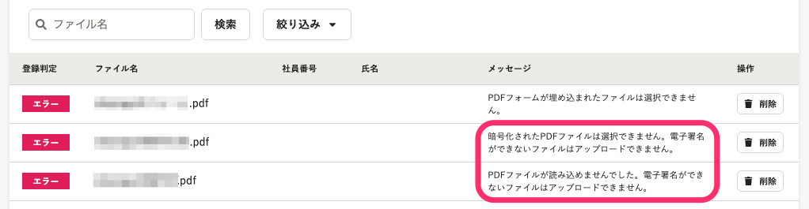
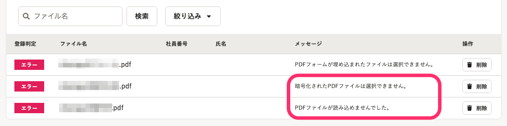

2021年7月29日（木）に行なったアップデートの詳細をお知らせします。

文書配付機能の変更点は、新機能1件・カイゼン1件でした。

# ✨ 新機能

## PDFファイルがアップロードされていない依頼を絞り込めるようにしました

これまでは、依頼グループ詳細画面でまだPDFがアップロードされていない依頼を探すには、目視で確認していく必要があり、探しづらい状態でした。

そのため、今回のリリースで、 **［PDF未アップロードの書類を絞りこむ］** リンクを追加し、PDFファイルがアップロードされていない依頼のみを絞り込めるようにしました。

 **［絞り込みを解除する］** をクリックすると絞り込みを解除できます。

# 📈 カイゼン

## PDFを一括アップロードした際のエラー文言を変更しました

これまではPDFを一括アップロードした際に、複数のエラーが発生した場合は、発生したエラーをすべて表示していました。

重複した内容のエラーも表示されていたため、エラーの解決方法がわかりづらくなっていました。

そのため、エラー内容は根本的な要因1つのみを表示するようにしました。

| 変更前 | 変更後 |
| --- | --- |
|  |  |
