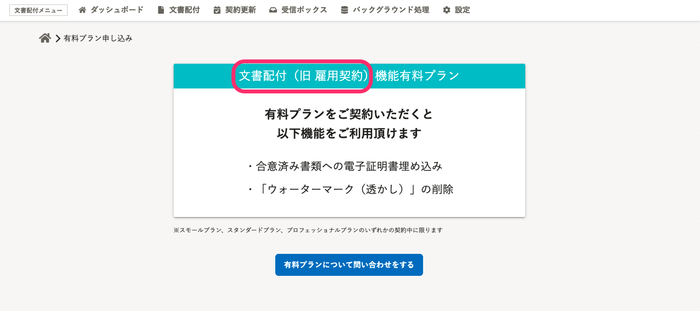
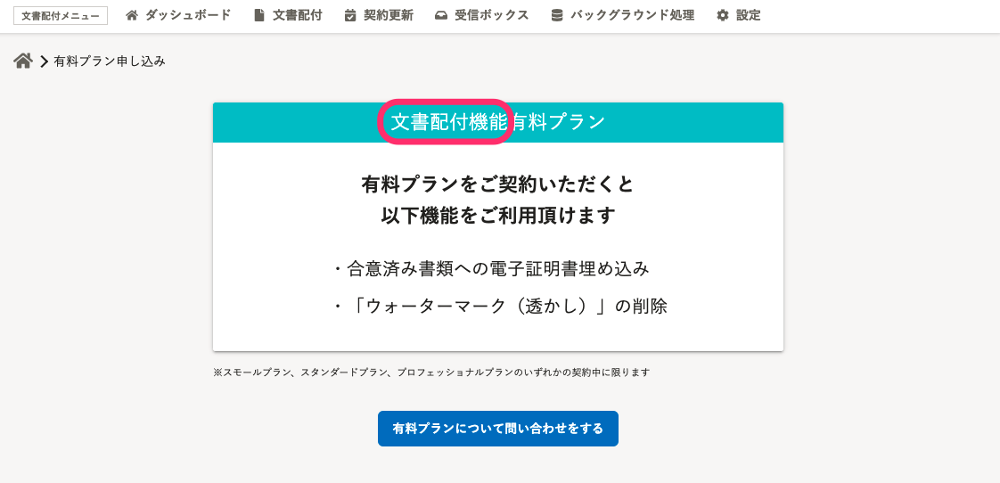
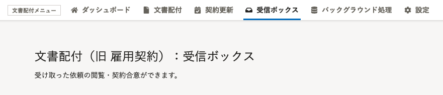
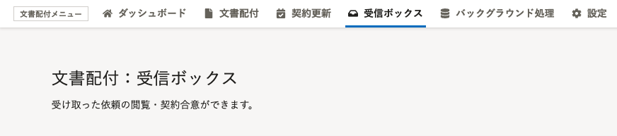

2021年8月24日（火）に行なったアップデートの詳細をお知らせします。

文書配付機能の変更点は、カイゼン1件でした。

# 📈 カイゼン

## ［文書配付（旧：雇用契約）］の機能名を［文書配付］に統一しました

 **［雇用契約］** から **［文書配付］** への機能名の変更が浸透したため、文書配付画面にある **（旧：雇用契約）** を削除し、 **［文書配付］** に統一しました。

| 変更前 | 変更後 |
| --- | --- |
|  |  |
|  |  |
