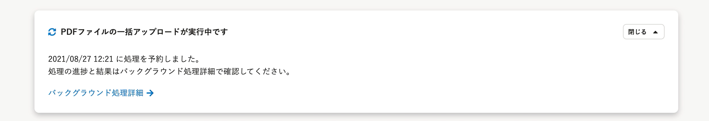

2021年8月26日（木）に行なったアップデートの詳細をお知らせします。

文書配付機能の変更点は、カイゼン1件でした。

# 📈 カイゼン

## PDFファイルの一括アップロードを実行した際に、ファイル数にかかわらず実行中のパネルを表示するようにしました

これまではPDFファイルの数が少ない場合、一括アップロードを実行したあとに、依頼グループ詳細画面に実行中のパネルが表示されないことがありました。

パネルが表示されないと、実行中にエラーがあった場合に気づきにくいため、ファイル数にかかわらず、実行中のパネルを表示するようにしました。

