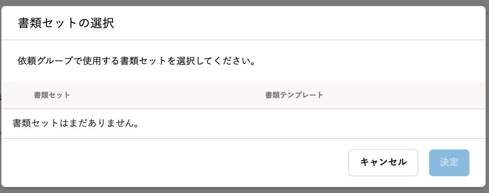
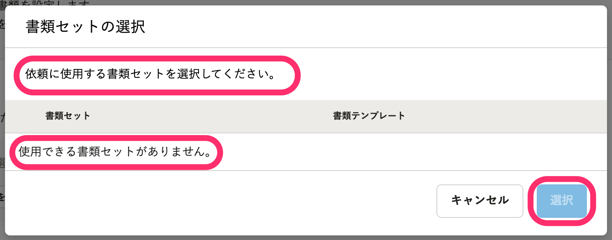
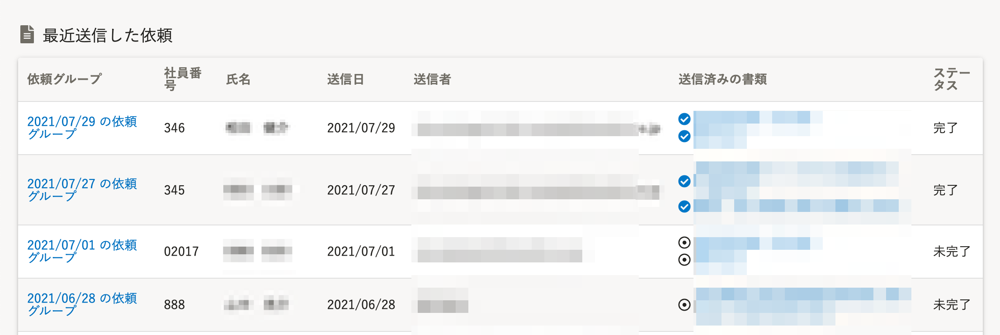
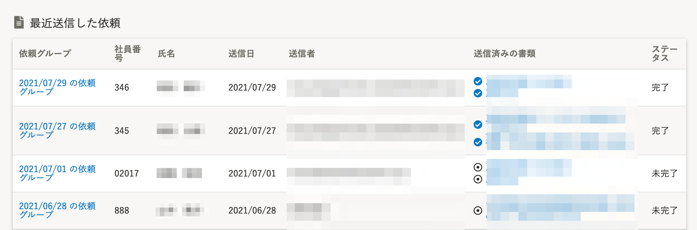
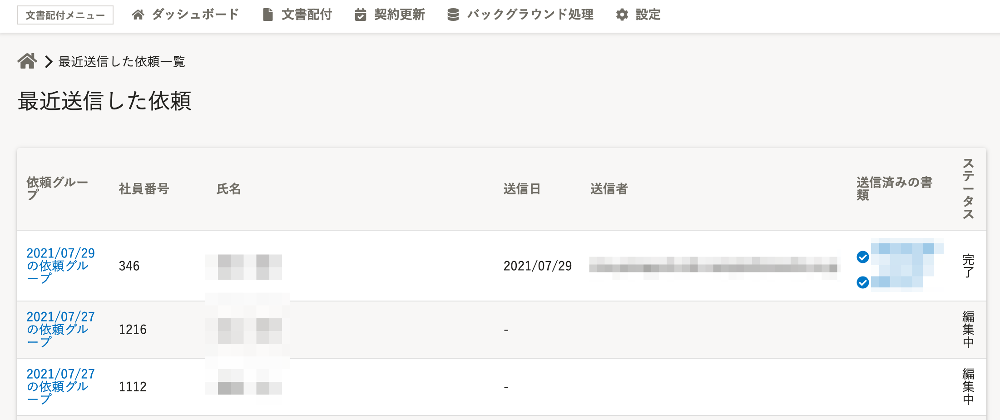
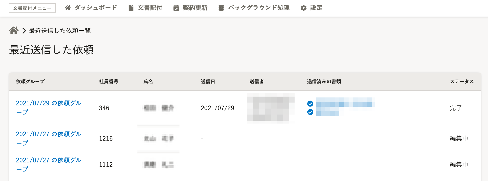

2021年8月31日（火）に行なったアップデートの詳細をお知らせします。

文書配付機能の変更点は、カイゼン2件でした。

# 📈 カイゼン

## 依頼グループを作成する際の［書類セットの選択］の文言を変更しました

依頼グループを作成する際に表示される **［書類セットの選択］** ダイアログの文言を、SmartHR全体の表記ルールにあわせて、下記のとおり変更しました。

- 依頼グループの作成（2/4）画面にある操作文にあわせた文言に変更
- ボタン名 **［決定］→［選択］** に変更
- 利用できる書類セットがない場合の文言変更

| 変更前 | 変更後 |
| --- | --- |
|  |  |

## ［最近送信した依頼］一覧のデザインを変更しました

トップページ下部に表示される **［最近送信した依頼］** 一覧と、 **［一覧を見る］** をクリックして表示される **［最近送信した依頼］** 一覧を、SmartHR全体のデザインにあわせたデザインに変更しました。

**トップページ下部 >［最近送信した依頼］一覧**

| 変更前 | 変更後 |
| --- | --- |
|  |  |

 **［一覧を見る］** \> **［最近送信した依頼］** 

| 変更前 | 変更後 |
| --- | --- |
|  |  |
