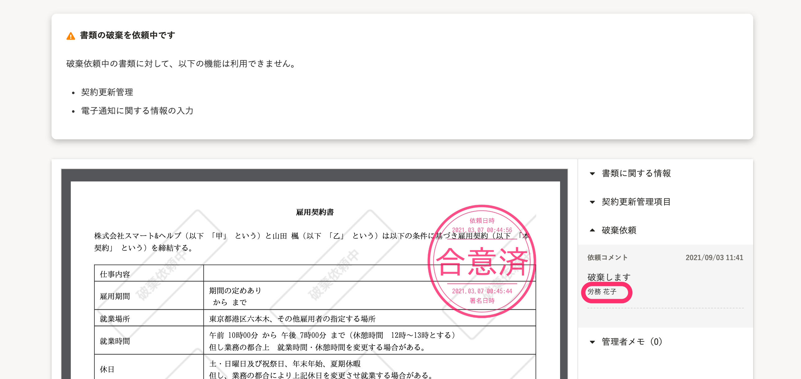

2021年9月1日（水）に行なったアップデートの詳細をお知らせします。

文書配付機能の変更点は、カイゼン3件でした。

# 📈 カイゼン

## 破棄依頼のコメントを作成日の昇順で表示するようにしました

書類詳細画面に表示される破棄依頼のコメントをコメント作成日時の昇順で表示するようにしました。

管理者メモの仕様にあわせた対応です。

## 受信ボックスの送信者欄と書類詳細画面の破棄依頼コメントの氏名をビジネスネームで表示するようにしました

受信ボックスの送信者欄、書類詳細画面の破棄依頼のコメントの氏名をビジネスネームで表示するようにしました。

姓・名のそれぞれで、ビジネスネームが設定されている場合に表示されます。

 **［受信ボックス］>［送信者］** 

書類詳細画面> **［破棄依頼］** \> **［依頼コメント］** の氏名

## ［依頼グループの新規作成］と［新規作成の取り消し］のダイアログ内の文言を変更しました

SmartHR全体の表記ルールにあわせて、 **［依頼グループの新規作成］** の確認ダイアログと、 **［新規作成の取り消し］** の確認ダイアログ内の文言を変更しました。

 **［依頼グループの新規作成］** 

| 変更前 | 変更後 |
| --- | --- |
|  |  |

 **［新規作成の取り消し］** 

| 変更前 | 変更後 |
| --- | --- |
|  |  |
