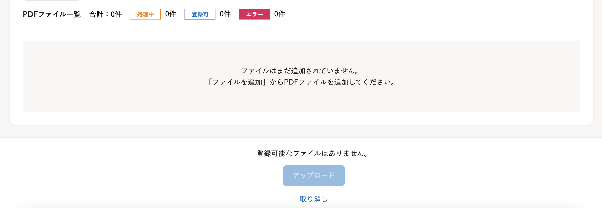
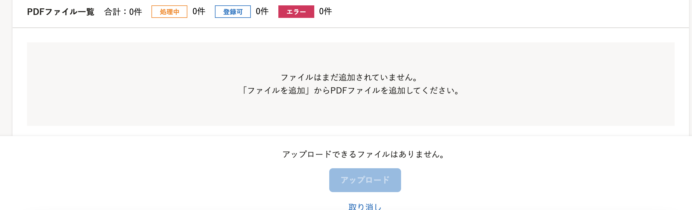
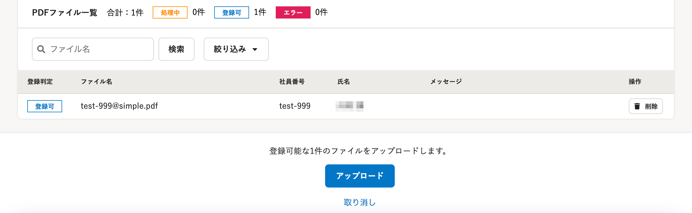
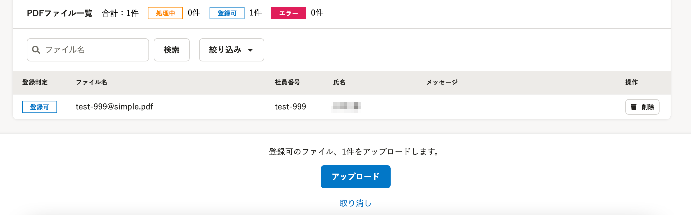
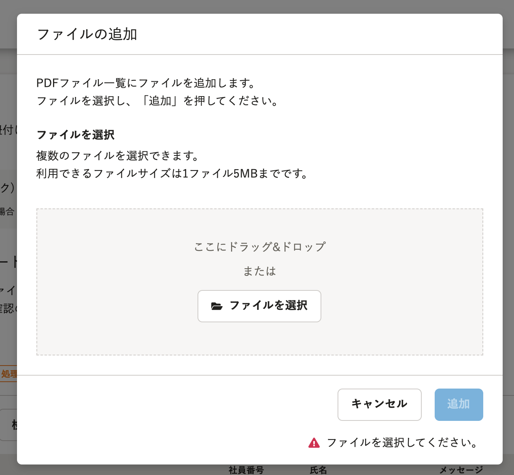
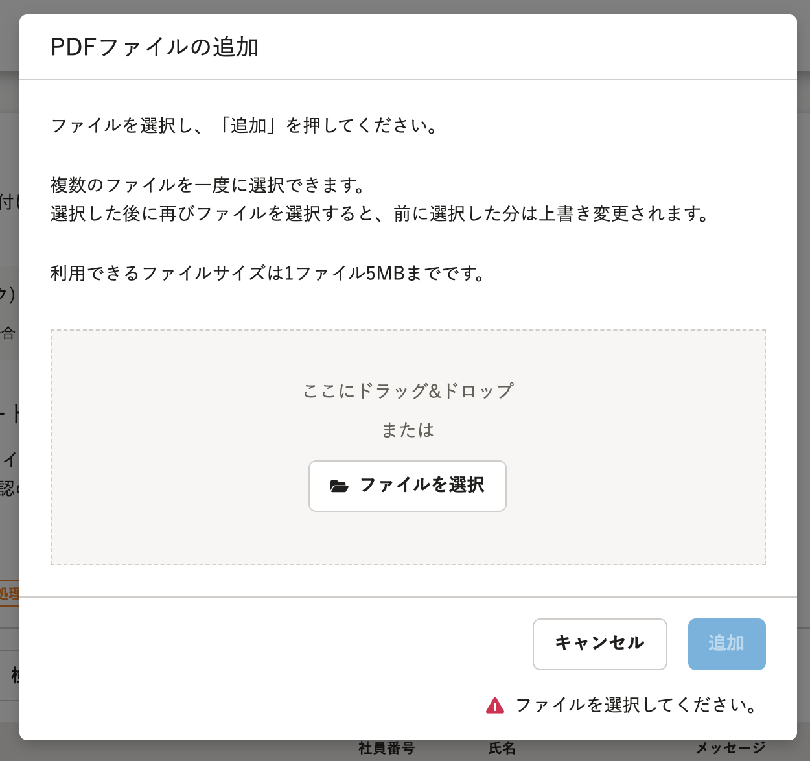

2021年9月13日（月）に行なったアップデートの詳細をお知らせします。

文書配付機能の変更点は、カイゼン2件でした。

# 📈 カイゼン

## PDFファイルのアップロード状況の文言を変更しました

PDFファイルの一括アップロード画面下部に表示されるアップロード状況の文言を、下図のとおり変更しました。

| 変更前 | 変更後 |
| --- | --- |
|  |  |
|  |  |

## PDFファイルを一括アップロードする際のダイアログ内の文言を変更しました

PDFファイルの一括アップロードする際に表示されるダイアログ内の文言を、下図のとおり変更しました。

| 変更前 | 変更後 |
| --- | --- |
|  |  |
