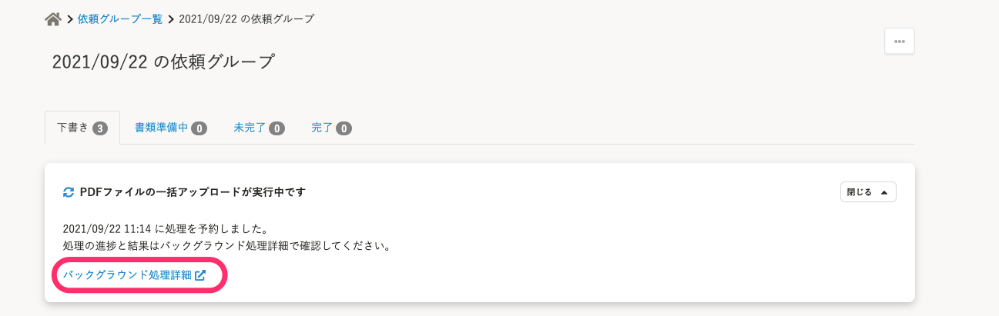

2021年9月22日（水）に行なったアップデートの詳細をお知らせします。

文書配付機能の変更点は、カイゼン1件でした。

## PDFファイルの一括アップロード中のパネルから、バックグラウンド処理詳細を別タブで開くようにしました

依頼グループ詳細画面で、PDFファイルの一括アップロード中に表示されるパネルに対する修正です。

これまでは、 **［バックグラウンド処理詳細］** をクリックすると、同じタブでバックグラウンド処理詳細が表示されていましたが、別タブで表示するように変更しました。

これにより、画面の切り替えがスムーズにできるようになりました。

