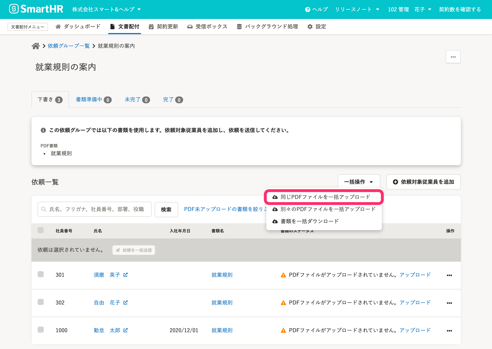

2021年9月27日（月）に行なったアップデートの詳細をお知らせします。

文書配付機能の変更点は、新機能1件・カイゼン1件でした。

# ✨ 新機能

## 同一のPDFファイルを一括アップロードできるようにしました

これまでは、PDFファイルの一括アップロードは、内容が異なるファイルのみ対応していました。

今回のリリースで、同じ1つのPDFファイルを依頼グループ内のすべての従業員にアップロードできるようにしました。

詳しくは、下記のお知らせとヘルプページをご覧ください。

[【文書配付】同一のPDFファイルを任意の従業員に一括でアップロードできるようになりました](https://smarthr.jp/update/28729)

[PDF書類にPDFファイルをまとめてアップロードする](https://knowledge.smarthr.jp/hc/ja/articles/4402741674393)

# 📈 カイゼン

## 依頼グループへの対象従業員を選択する際に、従業員を一括で選択できるようにしました

依頼グループへの対象従業員を選択する際に、画面に表示されている従業員を一括で選択できるようにしました。

複数の従業員を一度に選択でき、選択している従業員の人数が表示されます。

※ 画面に表示されている従業員のみが対象となり、ページをまたいで選択することはできません。

