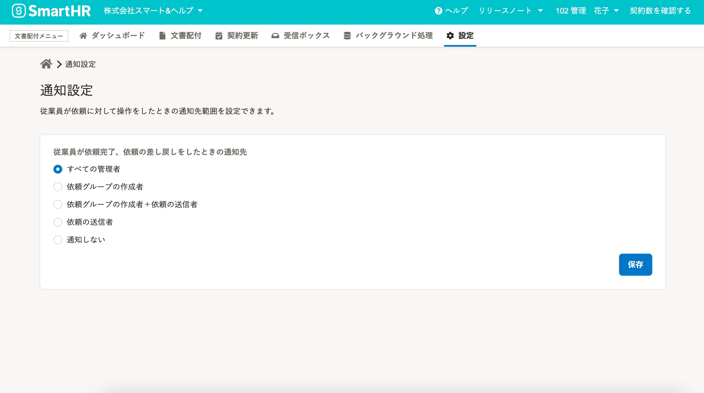

2021年10月7日（木）に行なったアップデートの詳細をお知らせします。

文書配付機能の変更点は、新機能1件でした。

# ✨ 新機能

## 従業員の書類合意・確認依頼完了時と依頼の差し戻し時の通知先を設定できるようにしました

これまでは、従業員が書類を合意・確認依頼の完了時や、依頼を差し戻した際、管理者のみにメールの配信とSmartHR上での通知があり、その他の権限のアカウントでは通知を受け取れませんでした。

今回のリリースにより、従業員が依頼を完了・文書を差し戻した際のメール配信先とトップページの通知先範囲を設定できるようにしました。

また、メールとSmartHR上での通知が不要な場合は、通知をしない設定ができます。

これらの設定は **［設定］>［通知設定］** で変更できます。

詳しいお知らせや操作方法は、下記のページをご覧ください。

[【文書配付機能】依頼の完了時・差し戻し時の通知設定ができるようになりました](https://smarthr.jp/update/29087)

[依頼完了時・依頼の差し戻し時の通知先を設定する](https://knowledge.smarthr.jp/hc/ja/articles/4407530909593)
